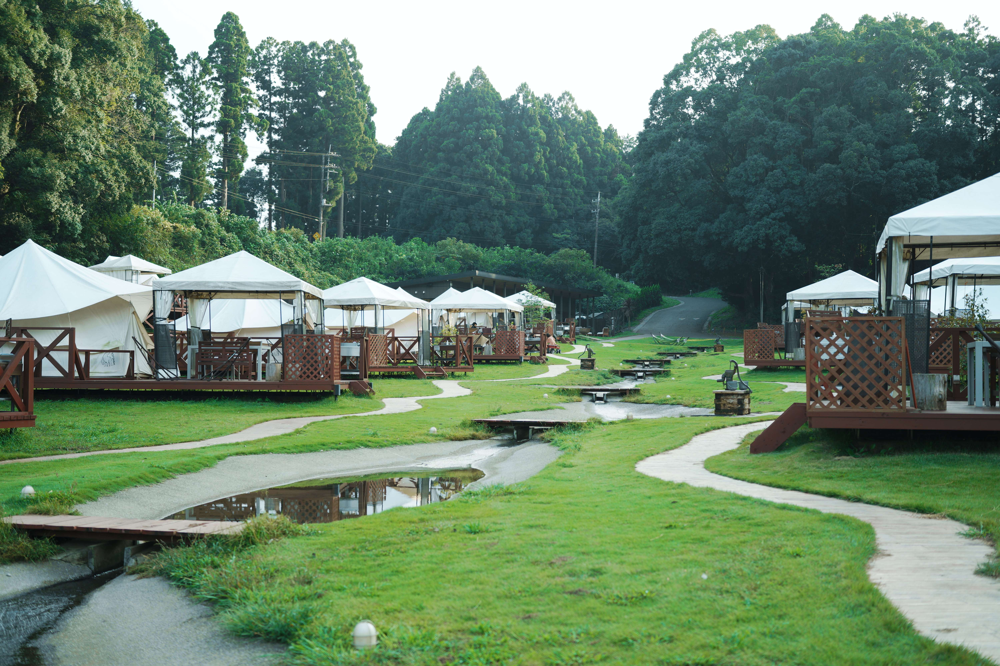

千葉県にある[The farm](https://www.thefarm.jp/)でグランピング[^1]をしてきました。前回は2019年に行ってから4年ぶりでした。

[^1]: グランピングとは、グラマラス（glamorous）とキャンピング（camping）を掛け合わせた造語で、自然の中でキャンプを楽しむ際に、ホテルのような設備やサービスを提供するキャンプ場のこと。
[グランピングとは - Wikipedi より引用](https://ja.wikipedia.org/wiki/グランピング)

## ワイン
東京駅グランスタにある[エノテカ](https://www.enoteca.co.jp/shop/gransta)でワインを買いました。 [ブラウ＆ブラウ](https://www.enoteca.co.jp/item/detail/0451741512)、
[ムートン・カデ・ルージ](https://www.enoteca.co.jp/item/detail/0176542212)のハーフサイズボトルを買いました。

そのあとは、高速バスで東京駅から施設の最寄りバス停まで移動しました。
高速道路を運転したくないので高速バスで行きました！

## 散歩や焚き火
15時前くらい到着したので、チェックイン後は散歩しながら合言葉をみつけるイベントに参加しました。

トンボがたくさん飛んでいて秋を実感しました。施設内ではヤギやポニーがいたのでちょっとだけ近づいて観察をしました。

そのあとはテントのそばで焚き火をしました。

## BBQ
夕食はBBQでした！下準備がされているので基本的に焼くだけです。食べるのに夢中で写真撮り忘れました！0.5ポンドのビーフといったお肉、焼き野菜のバーニャカウダなどを食べました！
美味しかったです！結構お腹いっぱいになりました！

## お風呂
施設内に[かりんの湯](https://www.thefarm.jp/karinnoyu/)という温泉施設があります。
前に来た時は、The 温泉という感じだったのですが、おふろカフェというものにリニューアルされていてサウナが3つでできていました。
お風呂以外にも本がたくさんおいてあって、ソファに座りながらゆったり過ごせるようになっていました。

## 朝食
朝食はビュッフェでした。サラダ2つ、パン4つ、カレー、スープ、ソーセージ3つ、チキンのトマト煮と朝からたくさん食べたら友人から引かれました。
美味しかったです！
そのあとはチェックアウトして、お風呂に入ってから帰りました。
## 東京駅に戻ってから
高速バスは2時間なので到着した時間は13時前だったので、[もへじ](https://kano-corp.tokyo/shop/)でもんじゃを食べました。
もんじゃを店員さんが焼いてくれるのですが、明太子もちもんじゃがめっちゃ美味しかったです！

人生でたべたもんじゃで一番おいしくて感動しました！

## おわり
久々に旅行に行けてよかったです！
計算したら今回使った金額が意外と少なくてびっくりしました！

