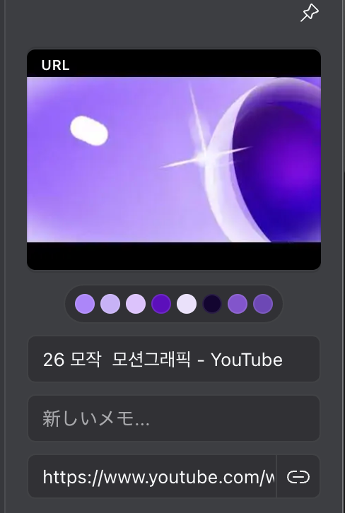

Readwise ReaderとEagleを使い始めた。

## Readwise Reader

<a href="https://readwise.io/read" data-iframely-url="//cdn.iframe.ly/api/iframe?card=small&url=https%3A%2F%2Freadwise.io%2Fread&key=878c5bef402f0b2911bf6d4ce6261abd">Readwise Reader: The first read-it-later app built for power readers.</a>

Readwise Readerは、記事をクリップしたり、フィード、メルマガを購読できるリーダーアプリ。
いままでNotionを使ってまとめていたが、PCによって使っているNotionアカウントが異なり、使いにくかった。Notionはフィードを購読できないのでまとめることにした。
AIで要約、質問もできるので便利。

### Difyと連携する
Readwise Readerには Web APIがある。任意の日時以降に追加された記事のみを取得できるので、1時間に一回チェックをして、追加された記事があればDifyのナレッジに追加するということをやっている。
自分が読んだ記事に基づき返答をくれるチャットボットができた。

## Eagle

<a href="https://eagle.cool/" data-iframely-url="//cdn.iframe.ly/api/iframe?card=small&url=https%3A%2F%2Feagle.cool%2F&key=878c5bef402f0b2911bf6d4ce6261abd">Eagle - Organize all your reference images in one place</a>

Eagleは画像やグラフィック、映像などの収集に特化したツール。
自分が作成したグラフィックの管理、YouTubeのモーショングラフィックの映像、気になった画像などをEagleにまとめている。

画像やYouTube動画のURLをEagleにインポートすると、そこで使われている色も記録される。

つまり、使われている色で検索ができるようになる。とても便利。

## おわりに
Readwise Readerは今のところいい感じだが、スマホでももっさり感が気になる。読むのは基本PCなので、まぁいいかなとは思っている。
