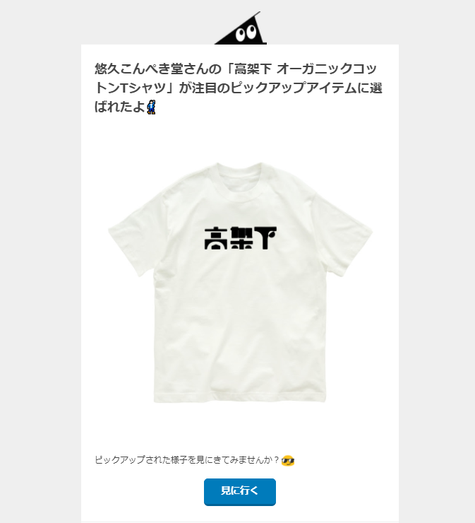

# ピックアップされてる！！

メールでピックアップされたとの内容のメールが来ました！まさか選ばれると思ってなかったので、とても驚きました！！

ピックアップされたアイテムはこちらから購入できます。

[高架下オーガニックコットンシャツ](https://suzuri.jp/yukyu_konpeki_dou/4837079/organic-cotton-t-shirt/l/natural)

# 「高架下」のデザインについて

アイテムの説明には

> 高架下の商店街をイメージしたロゴを印刷したアイテムです。高では高架下にあるお店をイメージして口を建物っぽい形にし，架はお店にかかる暖簾をイメージしました．下は高架下から見える夕日をイメージしました．

と書いています。詳細は以下の画像にまとめました。

ニュースで高架下にある商店街の特集を見て、思いついたので実際にデザインしてみました。東京にお出かけした際、夕方に高架下の焼き肉店に行った思い出があります。なので高架下＝夕方というイメージ強くありました。デザインにも夕日を配置しました。

# ピックアップされた感想

自分が作ったもので誰かの心を少しでも動かすことができ、単純に嬉しかったです。あと、ズッキュンされましたというメールが十数件ほど届き、驚きました。
今後も自分なりにデザインをしていきたいです！！！

このことを妹に伝えたところ「最近は自分でサコッシュ作ってるし、そのうち自分でデザインして服をつくって、ブランド作りそう。来年あたりパリにでもいってるんじゃない?」という誉め言葉を貰いました。
