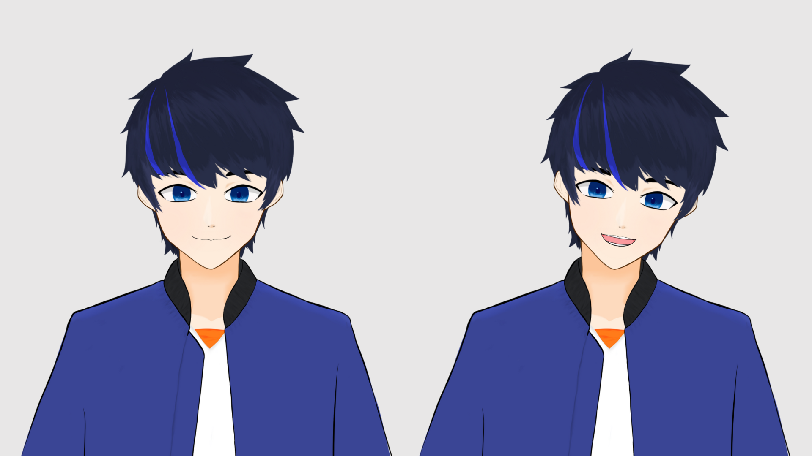
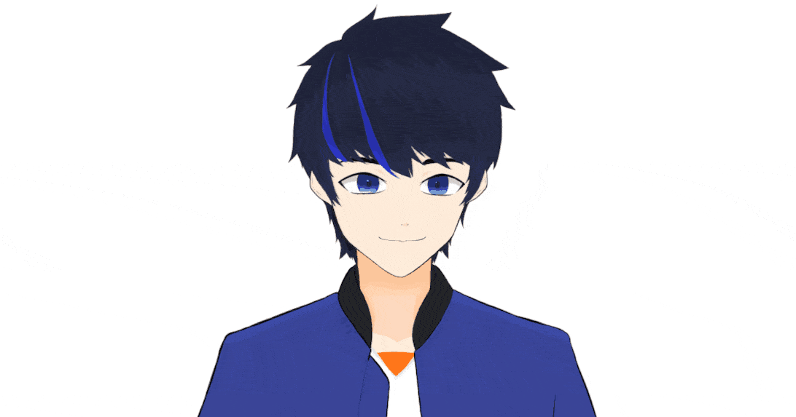

自身のキャラクターをデザインしてLive2Dモデルを作成しました。

## 概要

自身のオリジナルキャラクターをデザインし、Live2Dモデルとして動かせるようにしました。CLIP STUDIO PAINTでイラストを作成し、Live2Dで動きを付けました。
本モデルは[nizima](https://nizima.com/Item/DetailItem/54525)にて閲覧が可能です。

自分自身のLive2Dモデルを作成しました。キャラクターデザイン、モデリングを行いました。動画配信などで写らない下半身は書かれていません。

表情やリッピシンク、顔の動きなどのアニメーションも設定を行いました。

## 技術・ツール

- Live2D
- CLIP STUDIO PAINT

