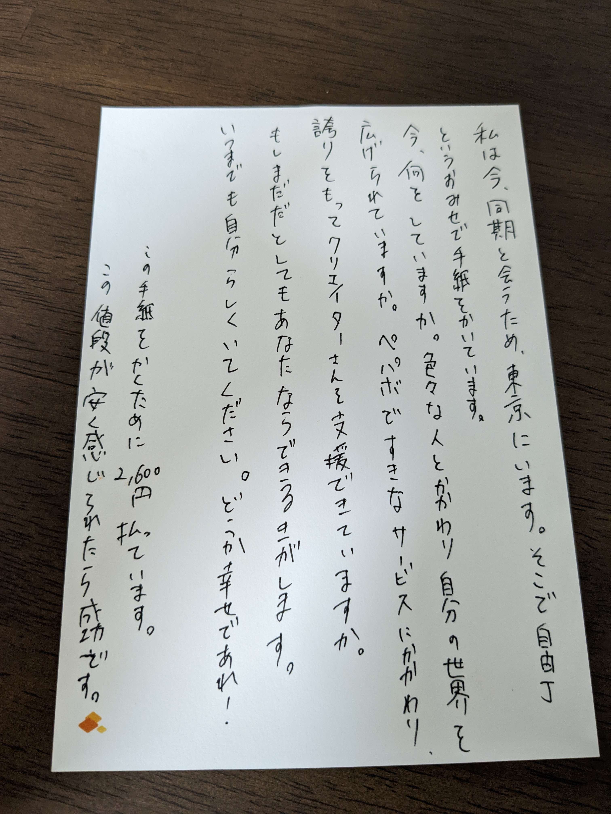

この記事は [SUZURI Advent Calender 2022](https://adventar.org/calendars/7825) の 2 日目の記事です

1 日目は、はーマンの[退勤 2022](https://note.com/___herman/n/nb516e23d3036)でした。
配属からの日々の退勤報告をまとめたものでした。個人的に好きな退勤報告は、9 月 7 日の退勤です。

---

こんにちは！SUZURI 新卒エンジニアの ugo です。
[2021 年 11 月 7 日に一年後の自分宛の手紙を書きました](./2021-11-07-part1)。その手紙が届いたので、その手紙を見ていこうと思います。

## 過去からの手紙と私の返信

> 私は今、同期と会うために、東京にいます。そこで自由丁というお店で手紙を書いています。
> 今、何をしていますか？色々な人と関わり自分の世界を広げられていますか。ペパボで好きなサービスに関わり、誇りを持ってクリエイターさんを支援できていますか？もしまだだとしても、あなたならできる気がします。いつまでも自分らしくいてください。どうか幸せであれ。
>
> この手紙を書くために 2,600 円を払っています。この値段が安く感じられたら成功です。

### 返信

今は SUZURI の開発をおこなっています。個性豊かな同期と優しく頼りになるパートナーさんとお仕事をしています。
同期の影響でカメラを買い、写真を撮るために見知らぬ街に出かけることもありました。デザインシステム定例などで、デザイナーさんの考えに触れ、生活の中で「これはなぜこの配色で、この配置なんだろうか」と思案することも増えました。多くの方から影響を受け、今まで以上に世界が豊かで広がりを持ったものになっています。
研修や業務のなかで フロントエンドからバックエンド、モバイルアプリ、テスト駆動開発、k8s などを学び、知っている事、できる事が増えました。研修で k8s 全くわからんからという状態から、何をするものか分かるようになるので、楽しみにしていてください。

SUZURI を通して、クリエイターさんを支援できています。創作活動で得た知識が仕事の役に立ったので、ぜひ好きなだけ創作活動と趣味を楽しんでください。自分の信念に背くようなことは一切なくお仕事をできています。いままでずっと SUZURI、ペパボに対して誇りを持って働けています。

入社してから、どのように他者と関わるべきか心配すると思いますが、同期のおかげもあり、杞憂に終わります。
今日も自分らしく幸せに過ごせています。

学生であり、バイトをしてない自分にとって、2,600 円の手紙はためらったはずですが、それでも手紙を書く選択をした一年前の私を誇りに思います。そして、その選択は正しかったです。今とても書いてよかったなと思っています。

---

## 一年後どんな自分でいてほしいか

### 一万円くらいのキーボードを買って喜んでいてください

「給与で高いものばっかり買って喜ぶ人間にはならず、ちょっとしたことで買い物で喜びを感じる人間でいてください」の意味だと思います。

これに対する今の自分のアンサーは…

**残念ながら、合計４万円くらいを使って、キーボードを組み立てて使ってます。**
**550 円のお皿を使いたいがためにウキウキしながら朝食を作るくらい、ちょっとした買い物で喜ぶ人間です。**

<blockquote class="twitter-tweet" data-dnt="true" align="center">
もはやこの皿とグラスを使いたいがために朝ごはんを作り、アイスコーヒーを淹れた <a href="https://t.co/7ECDO07jgj">pic.twitter.com/7ECDO07jgj</a>
&mdash; yukyu (a.k.a ugo) (@yukyu30) <a href="https://twitter.com/yukyu30/status/1571311725521276928?ref_src=twsrc%5Etfw">September 18, 2022</a></blockquote>

### Github Actions を使えるくらいで達成感を感じていてください

「少し何かができただけで達成感を得られる人間でいてください」という意味だと思います。

これに対する自分のアンサーは…

**Github Actions でレビューしてくれるボットを動かたり、RSS の実装で、やったーーー！とツイートするくらい達成感を得られる人間です。 会社ではタスクが終わった時、気づかれないようにガッツポーズをしています。**

<blockquote class="twitter-tweet" data-dnt="true" align="center" data-conversation="none">
やったーーーー！RSS実装できたよ！！！ <a href="https://t.co/cEtrfQi7rX">pic.twitter.com/cEtrfQi7rX</a>
&mdash; yukyu (a.k.a ugo) (@yukyu30) <a href="https://twitter.com/yukyu30/status/1553389720755146753?ref_src=twsrc%5Etfw">July 30, 2022</a></blockquote>

## おわりに

一年前の自分からの手紙を見ていきました。成長しつつも、初心を忘れないでいてほしいという過去の自分からのメッセージを感じました。今年も自由丁で一年後の自分宛の手紙を書こうと思います。

SUZURI アドベントカレンダーはまだまだ続きます！
~~5 日目は、なっちょさんです！よろしくお願いします。~~

#### 追記

執筆当時は３、４日と埋まっていなかったのですが、なんとカレンダーが埋まっていました！
3 日目を書いてくださるのは、がしゃどくろ さんです！
https://adventar.org/calendars/7825
