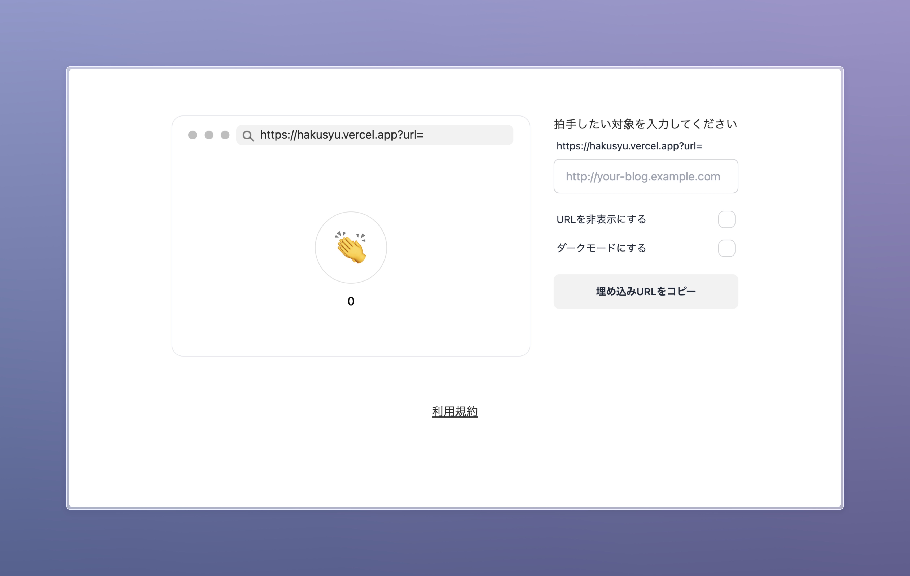

Notionに埋め込める拍手ボタンを作成するためのサイトを開発しました。https://hakusyu.yukyu.net にて公開しています。

## 概要

HakusyonはNotionページに埋め込み可能な拍手ボタンを生成するWebサービスです。Next.jsを使用して構築し、Notionユーザーがページにインタラクティブな要素を追加できるようにしました。

拍手したい対象（Notionのページ）を入力すると、その対象に対する拍手ボタンのURLが生成されます。それをNotionに埋め込むことで拍手ボタンを設置します。

## 技術スタック

- Next.js

## リンク

- [デモサイト](https://hakusyu.yukyu.net)
- [開発記事](https://zenn.dev/yu_9/articles/2022-12-17-hakusyu-on-notion)
