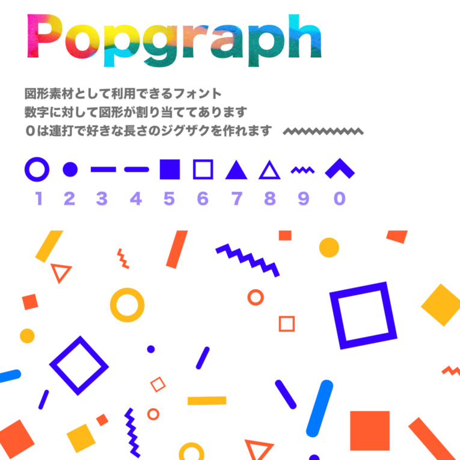

幾何学図形を数字に割り当てたフォントを制作しました。

## 概要

yukyu popgraphは幾何学的な図形を数字に割り当てたユニークなフォントです。テキスト入力と配置調整によって、様々なパターン画像を作成することができます。Affinity Designerを使用して設計しました。

## 技術・ツール

- Affinity Designer

## リンク

- [SUZURI（デジタル販売）](https://suzuri.jp/yukyu30/digital_products/445)
