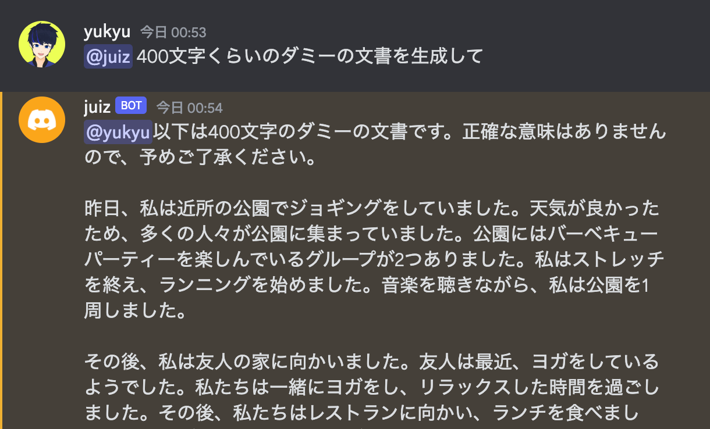

OpenAI APIを活用したRust製Discord botを開発しました。

## 概要

RustとOpenAI APIを使用して構築したDiscord botです。Shuttleへデプロイすることで、誰でも利用可能なAIアシスタントとして機能します。

## 技術スタック

- Rust
- OpenAI API
- Discord API
- Shuttle (デプロイプラットフォーム)

## リンク

- [GitHub](https://github.com/yukyu30/chatgpt-bot-for-discord)
- [開発記事](https://zenn.dev/yu_9/articles/737aca68c7fcd8)
