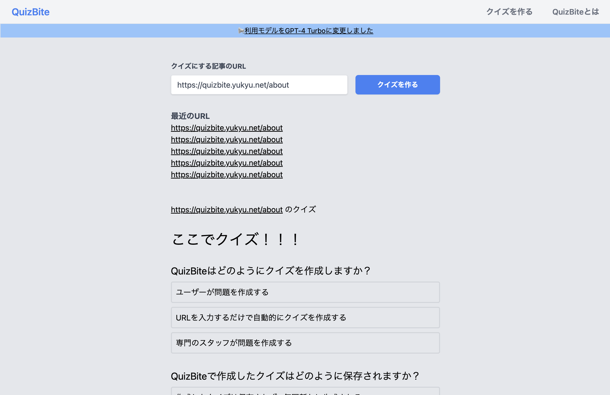

OpenAI APIを活用したクイズ生成Webアプリケーションを開発しました。

## 概要

Quiz BiteはNext.js、Rails、LangChain、OpenAI APIを組み合わせて構築したクイズ生成アプリケーションです。AIを活用して様々なジャンルのクイズを自動生成します。

## 技術スタック

- Next.js
- Rails
- LangChain
- OpenAI API

## リンク

- [デモサイト](https://quizbite.yukyu.net/)
- [開発記事](https://zenn.dev/yu_9/articles/cd31b6a904dcde)
