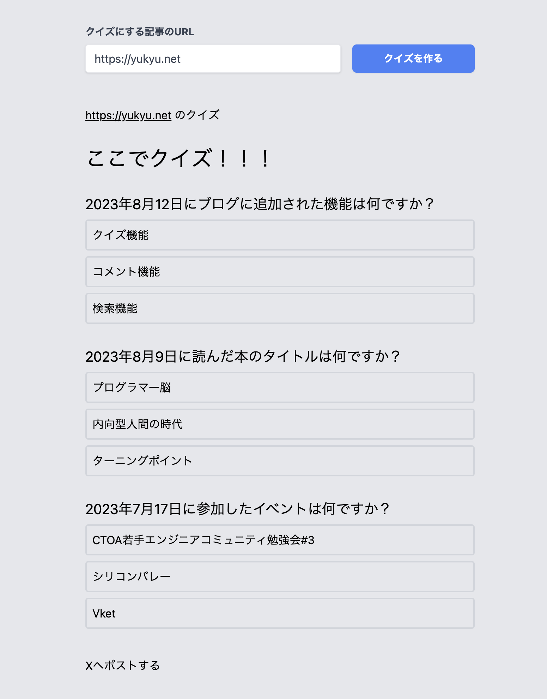

## QuizBiteをリリースしました
QuizBiteはURLを入力するとクイズが生成されるサービスです。
このブログにあるクイズ機能をサービス化したものです。

🔻 QuizBite 🔻  
https://quizbite.yukyu.net/

## 使い方
https://quizbite.yukyu.net/ にアクセスして、URLを入力してクイズを作るを押して、待つだけです。

https://quizbite.yukyu.net/?url=https://quizbite.yukyu.net/about
という形式でアクセスすると、URLが入力された状態になるので、そのままシェアしたらクイズを楽しめます

## 最終的な構成
### クイズ生成APIサーバー
  - Python
  - FastAPI
  - LangChain
  - Supabase

  PythonでFastAPIを使用しています。
  肝心のクイズ生成部分ではGPT-4とLangChainを使っていますが、今の段階ではLangChainでなくても実装はできそうです。

  将来的にはURLとプロンプトをPOSTして、クイズの数や難易度を調整できるようにしたいので、LangChainを使っています。
  
  生成されたクイズを保存するためにSupabaseを使用しています。サクッと導入できて便利でした。
  無料で使える分を超えた時はその時に考えます。

### Webサイト
  - Next.js
  - Vercel

  APIにリクエストを送るだけなので無難にNext.jsを使っています。

## 直したいところ
### クイズの生成に失敗しがち
LLMをつかっているので、出力がコードで期待されていない形式だと例外でエラーになります。結構多くて困ってます

### クイズの生成に時間がかかる
クイズの生成に時間がかかる。どうにかしたい

### 長い文章だとクイズが生成されない
GPT-4は8k tokenまでなので、それ以上の文章だとクイズが生成されないです。
GPT-4-32kに期待したいです。公開はやくー

## 楽しい
自分が欲しいものを作れてよかったです。
三連休でずっと作っていましたが、楽しかったです。
