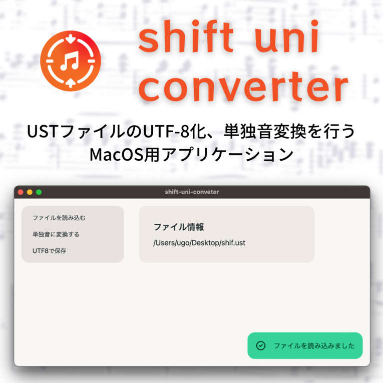

Mac版Synthesizer VでのShift-JIS USTファイルの文字化け問題を解決するツールを開発しました。

## 概要

Shift Uni ConverterはTauri、Rust、Next.jsを使用して構築されたデスクトップアプリケーションです。Mac環境でSynthesizer VやUTAUを使用する際に発生する文字エンコーディング問題を解決します。

## 技術スタック

- Tauri
- Rust
- Next.js

## リンク

- [SUZURI（ダウンロード販売）](https://suzuri.jp)
