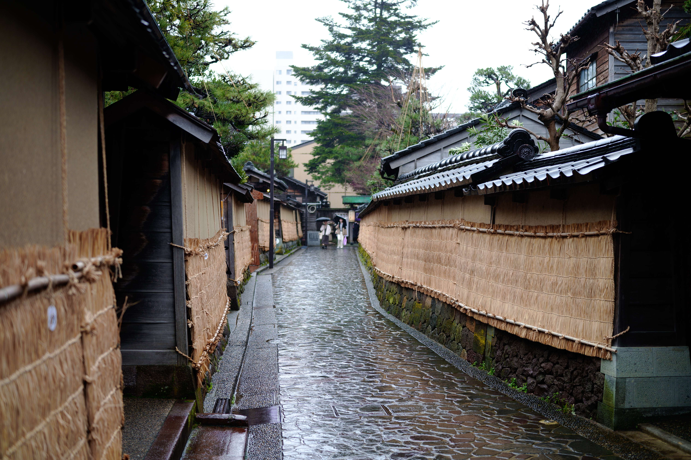

BuriKigi に参加するため富山に行きました。翌日は富山・金沢で観光をしました。

## 富山市ガラス美術館

富山に泊まっていたので、午前中は[富山市ガラス美術館](https://toyama-glass-art-museum.jp/)に行きました。

図書館が併設されているおしゃれな建物の中にありました。

展示物の SNS シェアは NG だったので、写真はありませんが、ガラスの作品がたくさんありました。
ガラスでしょと思って舐めてましたが、想像を超えるデカさの作品がいくつもありました。ガラスの色使いがとても綺麗でした。

## 金沢散策

午後からは金沢に移動して、観光をしました。
お昼には六角堂せせらぎ通り店でステーキを食べました。
目の前で焼いてくれるので、ずっと見てしまいました。もちろん美味しかったです。

長町武家屋敷跡界隈を歩きました。気になったお店にふらっと立ち寄り、ショッピングを楽しみました！

そのあとはバス移動で、ひがし茶屋街に行きました。
お茶屋さんがたくさんあり、どのお店に入るか迷いました。
ほうじ茶アイスとコーヒーを飲みました。

天気が回復してきたので、兼六園に行きました。
徽軫灯籠（ことじとうろう）を見て、そのあとは兼六園の中を散策しました。
想像以上の広さと、道の入り組み度合いにびっくりしました。
日本最古の噴水もみました！

近江町市場で散策して夕飯を食べようと思ったのですが、17:00 で閉まっていました。
しかし、一部の居酒屋はやっていたので、金沢おでんと刺身を食べました。

## 帰り

金沢駅に戻り、新幹線で帰りました。シンカンセンスゴクカタイアイスも食べました！

<blockquote class="twitter-tweet" data-dnt="true" align="center">
これが噂のアイスかー <a href="https://t.co/pTmcjw90vy">pic.twitter.com/pTmcjw90vy</a>
&mdash; yukyu (a.k.a ugo) (@yukyu30) <a href="https://twitter.com/yukyu30/status/1749023796991054327?ref_src=twsrc%5Etfw">January 21, 2024</a></blockquote>

## おわりに

一日歩き回って、食べて買って楽しかったです！
金沢 21 世紀美術館にも行きたかったのですが、地震の影響で休館していました 😢
