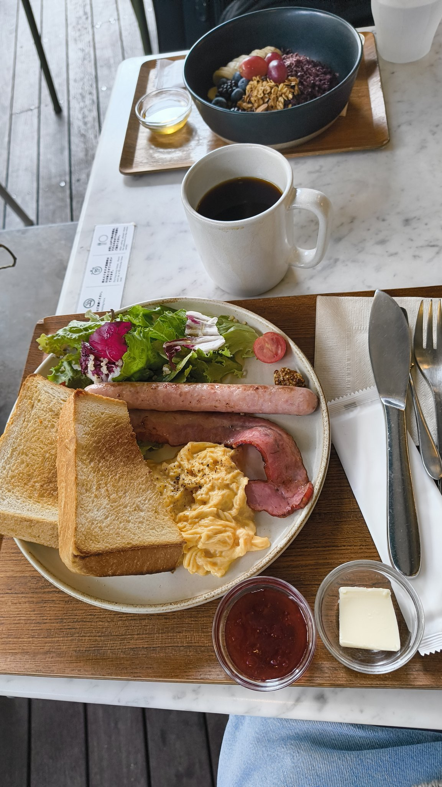
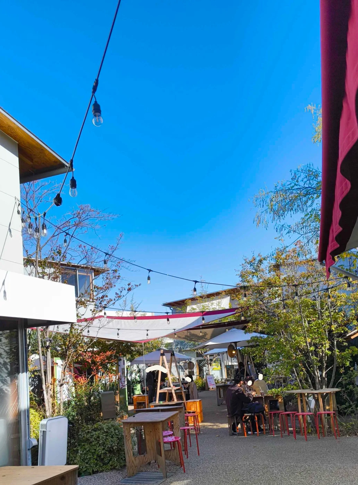
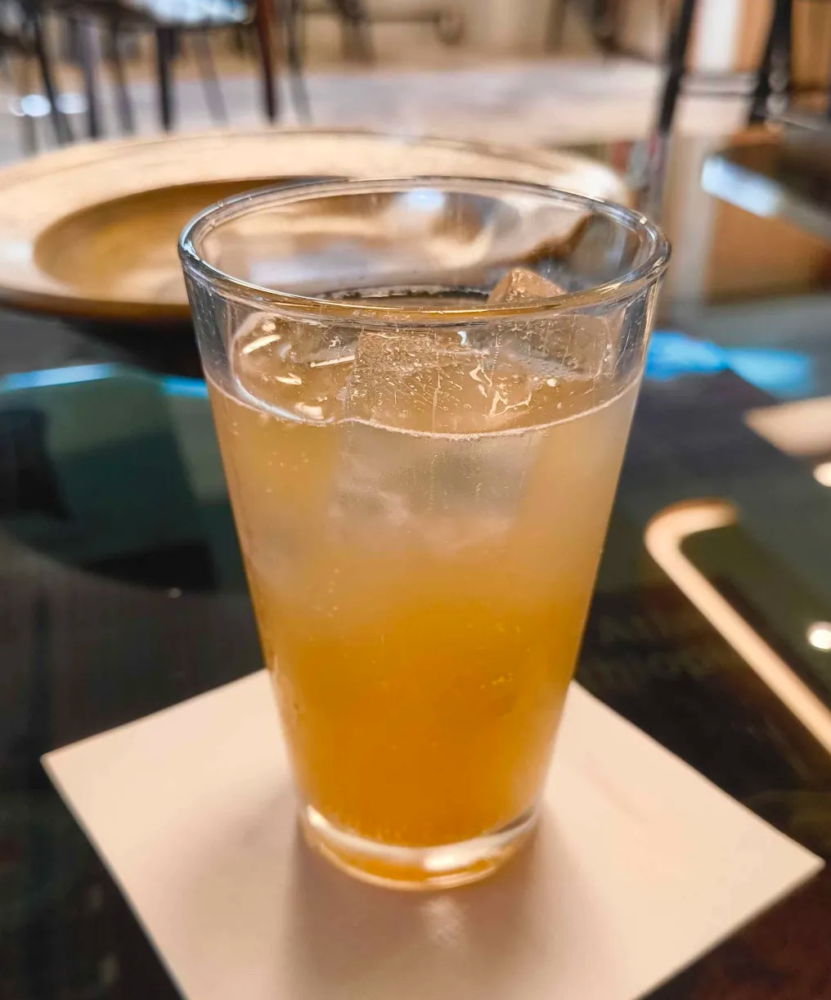
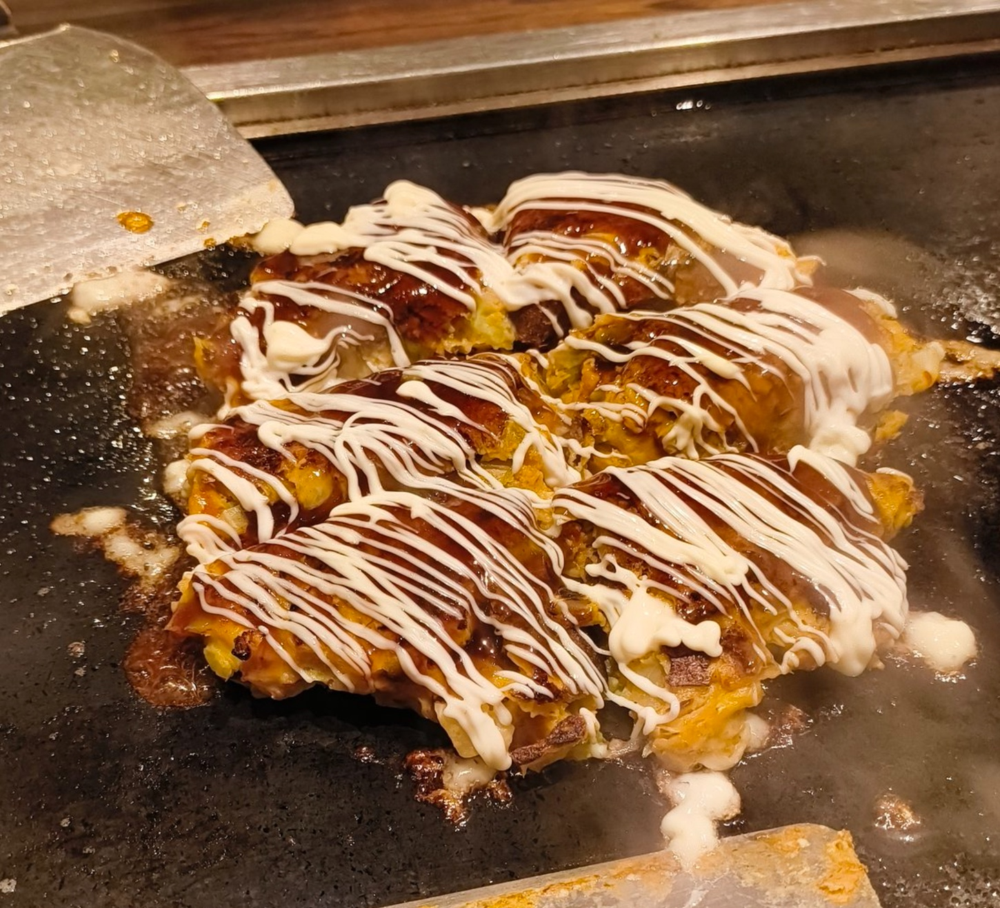

同僚とカフェ巡りをした。

## WHITE GLASS COFFEEでモーニング
9時に
[WHITE GLASS COFFEE](https://whiteglasscoffee.com/) で集合して、モーニングを食べるとだけ決めていた。
9時少し前は席に余裕はあったが9時過ぎには満席になっていた。
8時〜10時の間はモーニングメニューで6種類ほどのモーニングから選べた。
自分はモーニングプレート、ホットコーヒーを注文した。追加でスープもつけられるが今回はこの後もたくさんカフェに行くため付けなかった。

テラス席で緑に囲まれてゆるく過ごすのは心地よかった。

モーニングを食べながら次に行くお店を決めた。前から行きたかったFUGLEN HANEGIに行くことにした。

## 下北沢と世田谷代田にあるボーナストラックを散策
モーニングを食べた後だったので、
1. 電車で渋谷から下北沢へ
2. 歩いて下北沢から世田谷代田へ
3. 電車で世田谷代田から梅ヶ丘
というルートで移動した。
下北沢と世田谷代田にはボーナストラックというスポットがあるので歩くことにした。
真新しい建物がひしめき合うスポットで、磯焼きやコーヒーなどなどが売っていた。

ここも落ち着いていて良い雰囲気だった。

## FUGLEN HANEGI KŌENで、そばはちみつレモネード

渋谷にもあるが、あえて羽根木公園近くの[FUGLEN HANEGI KŌEN](https://fuglencoffee.jp/)に行った。
自分はコーヒーを短期間にいっぱい飲むと気持ち悪くなってしまうので、そばはちみつレモネードにした。

一緒にきた同僚はティスティングフライトと呼ばれる飲み比べのセットを注文していた。違いが気になるので次来た時には注文してみたい。

お店に置かれた周辺のマップをみていたら、お寿司がランチのみ500円から食べれる「いこま寿司」なるものを見つけた。ランチはこのお店に行くことに決めた。

## 10貫とあら汁で800円の寿司ランチ
1人前の寿司ランチが500円、1.5人前が800円、各種丼ものが500円だった。
1.5人前の寿司ランチを頼んだ。

しっかり美味しかった。秋葉原でゲーミングデバイスを見に行きたいということになったので、秋葉原に行くことにした。

## 新宿の乗り換えついでに大塚家具でオフィスチェア探し
電車の乗り換えついでに新宿の大塚家具でオフィスチェアを見に行った。
同僚が購入を検討しているので、オカムラをすすめておいた。他社の椅子を購入しようと思っていたが、オカムラにするらしい。
自分もシルフィのヘッドレストが欲しくなった。

## 秋葉原で大きなパンケーキたべた
PCショップを巡りつつ、[CAFE OASIS](https://www.instagram.com/cafe_oasis_akihabara/)に行った。

カステラパンケーキをみんなで食べた。とろとろ系のスフレパンケーキは苦手だが、カステラパンケーキは柔らかいが、とろとろした感じはなく美味しかった。結構大きいがバターとシロップのシンプルな味付けなのでサクッと食べられた。

## 萩の湯で汗を流す
鶯谷にある萩の湯に行った。
バスタオルセットで650円で入浴できた。
お風呂の種類は4つくらいあったが、どれも人が多く人気のようだった。
椿の香りがするピンク色の温泉が良い匂いがした。
休憩処では、伊良コーラを飲みながら本を読んでいた。

## お好み焼きたべた
晩御飯を食べるため、お店を探していたら[「えん」](https://tabelog.com/tokyo/A1311/A131105/13102480/)という鉄板焼きやさんを見つけた。

満場一致で歩いて向かった。
お好み焼き2つと焼きそばを頼んだ。お好み焼きを目の前で焼いてもらった。
地域の人に愛されているようでアットホームなお店だった。

食べた後は、ざらめのついたまん丸の飴玉をもらった。この種類の飴玉は地味に好きなので嬉しかった。

## 早起きすると時間の流れが遅く感じて
午前9時に集合して、解散したのは午後9時だった。これだけ楽しんでまだ、午後9時！？と嬉しい気持ちになった。

集合するお店だけ決めて、そのあとはその場で決めるお出かけは様々なところにいって、思いがけない出会いがあり、とても刺激的だった。

