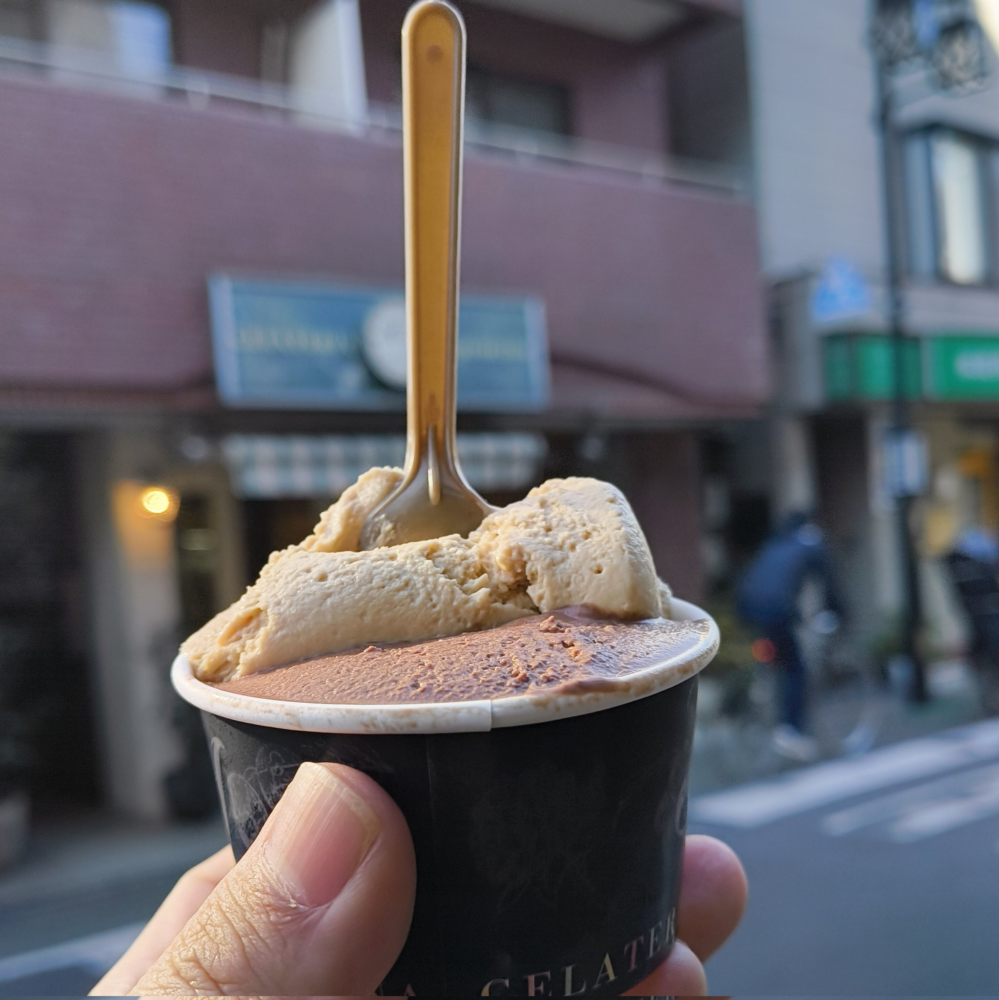
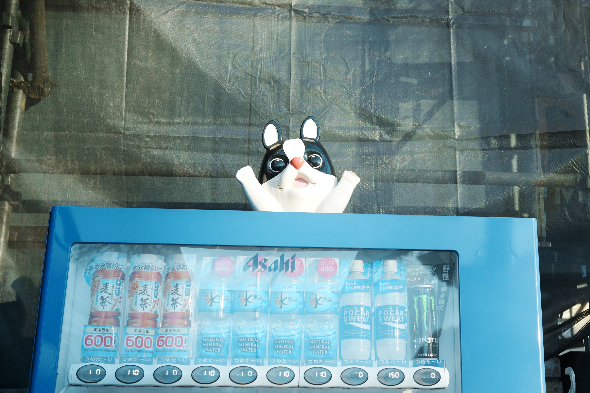

月曜に祐天寺と中目黒で遊んだ。

## イタリアンレストランReal 祐天寺店でランチ
パスタ、ピザ(1ピース)、サラダ、ドリンクのセットを頼んだ。海のトマトスープパスタはシーフードがたくさん入っておりおいしかった。スープも飲み切った。

デザートに、近くのお店でジェラートを食べた。
メキシカンチョコレート、アールグレイの2種盛りにした。メキシカンチョコレートは、かすかにほろ苦さがあり、アールグレイは、さっぱりとしていたが、香りがつよかった。さっぱりとしながらも満足感のある味だった。

## 中目黒で有名なドーナツを買った
祐天寺という名の通り、祐天寺というお寺が存在する。散歩しながら、祐天寺に参拝に向かった。
参拝後は、中目黒で、目黒川沿いを散策したのち、高架下にあるＩ'm donut ?でドーナツを買った。

そのあとは、カフェに行った。

パンがもちっとしていておいしかった。

## 光明泉で温泉に入った
光明泉という名の銭湯に行った。
タオルセットと、ボディソープをつけて、700円くらいだった。
浴槽は2つで、水風呂が1つの3つだった。
炭酸泉は、温度が低めでずっと入れるようなお風呂だった。もう一つはしっかり熱いお風呂だった。
地域の人から愛されているようで、受付から今年もよろしくお願いしますねと絶えず聞こえてきた。

## しゃぶしゃぶ れたす で野菜とお肉を食べた
しゃぶしゃぶ れたす 中目黒店に行った。
2人で行ったが、一人一鍋方式なので、だしも食べるものも、〆も自分の好きに調理できる。

コースを頼むと、野菜とお肉が届く。野菜はボリュームがあるが、食べ始めると意外とペロッと行けてしまった。

追加の注文では
牛タン、レタスをひたすら食べていた。
シイタケも肉厚でおいしかった。

個人的おすすめは、和だしの鍋に、牛タン、塩レモンたれ。

〆には雑炊にとろろ、はちみつ醤油をかけて食べた。めっちゃおいしくて、ご飯を追加した。

デザートは、ほうじ茶ティラミスにした。ティラミスは苦手だが、これはおいしかった。

## 写真
ここ最近は、SIGMA fpで写真を撮ることにはまっているので取った写真をいくつか載せておく。

以上！
