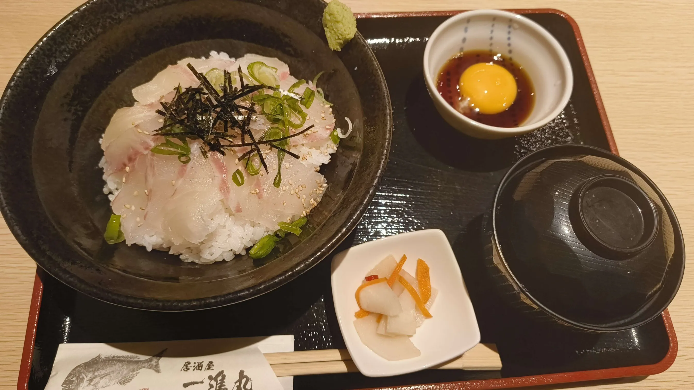

4月16日から4月19日の間に、松山に宿泊して、RubyKaigiに来ている。

ざっと1日を振り返ります！

## Ruby Committers and the World 
Ruby Commiterのトークセッション。
RubyにStatic Barrierを入れるか、Rubyに入れたい機能などのテーマがあり、それについて話すのを聞いていた。
非推奨にするは数年かかる、後方互換性を保つためには..、などの実際にRubyがどのようなタイムスパンで考えられているのか知ることができた。

Rubyを作るためにAIを活用するのが難しいという話を聞いて、なるほどなぁと思った。

## Analyzing Ruby Code in IRB
実際にIRBを手元で動かしながら話をきいていた。

Rilas Consoleでは使わないような、複雑な構文を入力してためしていたが、正しく色がつけられており、面白いなと感じた。

実際の動作は理解できなかったが、興味深かった

## Programming Language for AI age

AI時代のプログラミング言語に求められていることは
- 簡潔
  - 短くできる方がAIとのやりとりの効率がいい
  - 本質に集中できる
 - 表現力
   - 簡潔だが、現実世界の問題に対して記述できる表現力
 - 拡張性

これ満たすのってRubyだよねという話に辿り着いた。

Ruby 4.0が今年でる（多分）とのことなので楽しみ。

## ランチ
道後温泉にある、ご飯屋さんで鯛めしを食べた。

帰りがけに蛇口からみかんジュースが出るお店で、みかんジュースの飲み比べをした。

## TOKIUMO × mybest Drinkup
会の途中でLTがあるDrinkupだった。
知らないことについてAIにスライドを作成して、あたかも知っているように話すLTがあり面白かった。

mybestはwebサイトのイメージが強いが、アプリもあるのが意外でびっくりしたのでその話をしたり、
最近のAIツールの話などをした。

## Ruby Music Mixin
11時くらいに行ったら、入場規制がかかっていたので、カラオケをして0時過ぎに入った。

2時くらいからは同僚がVJとDJをしていたので、それを聞いていた。

## 今日の動画

<iframe title="2025/04/18 RubyKaigi 2025 Day3" src="https://www.youtube.com/embed/P8c0qJ-PTA4?rel=0" style="top: 0; left: 0; width: 100%; height: 100%; position: absolute; border: 0;" allowfullscreen scrolling="no" allow="accelerometer; clipboard-write; encrypted-media; gyroscope; picture-in-picture; web-share;"></iframe>
