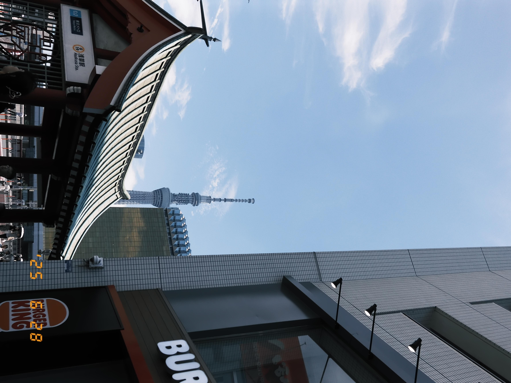
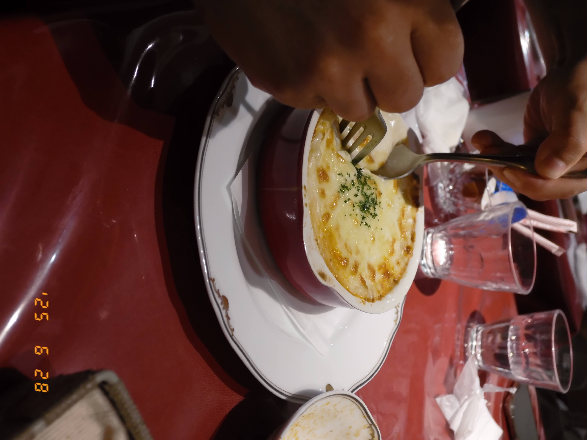
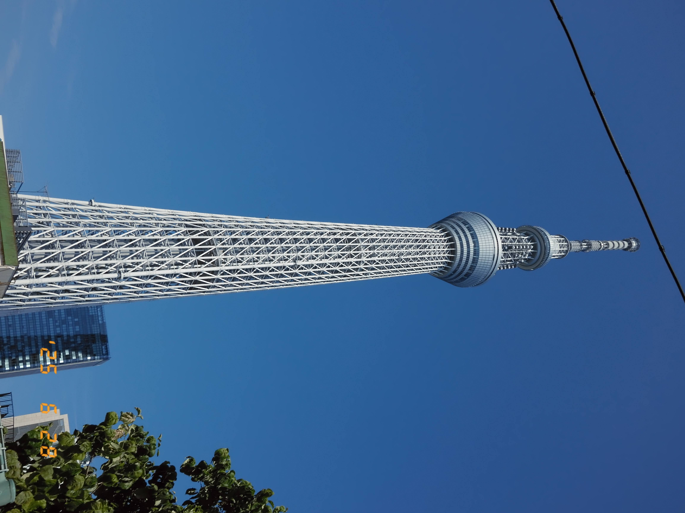
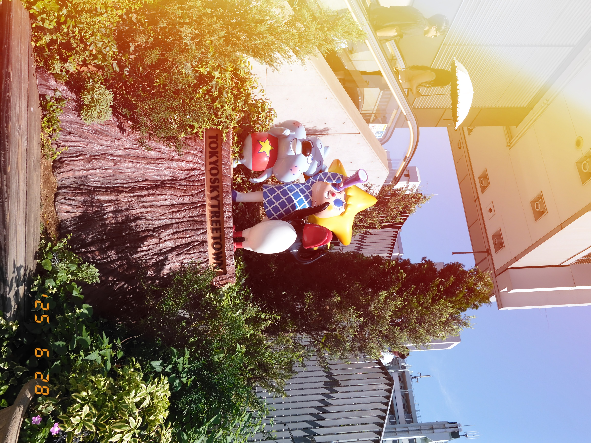
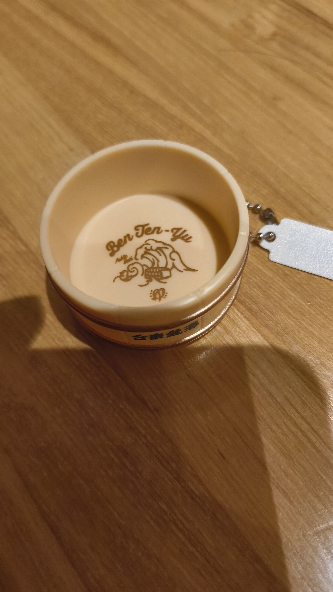

土曜日に、同僚とリアル脱出ゲームにいき、スカイツリーを下から眺め、蔵前でお茶をした。

## リアル脱出ゲーム
浅草で[Escape from the RED ROOM](https://realdgame.jp/event/redroom)という公演のリアル脱出ゲームをしてきた。
惜しくも脱出失敗だったが、あともう少しというところだったので悔しかった

## ランチ
ポンパドールという洋食屋さんに行った。ラザニアをたべた。
ランチだと、スープ、サラダ、ドリンクがついて1,400円くらいだった。
近所の人に人気そうで店は良い雰囲気だった。

## スカイツリー

アメイジング・デジタルサーカスにポップアップがソラマチでやっていたのでランチの後に行った。
悩みに悩み、ジャックスのフィギュア、ケインのフィギュアを買った。
子供もいたが、大人の方が多かった感じがした。

## 蔵前
電車に乗り、蔵前へ。
喫茶 半月に行った。パイナップルのショートケーキと、カフェラテを頼んだ。

パイナップルの食感と味がしっかりとのこっていつつもケーキに馴染んでいてとてもおいしかった。

そのあとは、文具のカキモリにいき、隅田川のほとりで景色を眺めていた。

.JPG)

夕方になってきたので、弁天湯に行きお風呂に入った。台東区の温泉スタンプラリーに参加して、スタンプと木桶キーホルダーをもらった。

弁天湯近くにある、うどんやさんでご飯と食べて、解散した。

## 感想
一日を通して、いろんなことをしたので、とても充実した日だった。
脱出ゲームも久々で緊張したが、みんなと力を合わせて、わちゃわちゃできて楽しかった。

脱出ゲームで冷静になって後ろで様子を眺めがちな人間だと分かった。リアルで起きたら一番パニックになる自信はある。