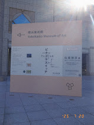

待ちに待った横浜美術館の[佐藤雅彦展　新しい×（作り方＋分かり方）](https://yokohama.art.museum/exhibition/202506_satomasahiko/)
に行ってきた。

## 蒐集への勇気
佐藤雅彦さんは、ピタゴラスイッチや、だんご三兄弟などのコンテンツを作った映像作家。映像を作る中で、「作り方を作る」という手法と取っていた。

佐藤雅彦さんの作品の一部に、自らが蒐集(しゅうしゅう）したものから、なぜ好きなのか共通点を見つけ出し、その共通点をルールとして定めて、作った作品があった。

自分がなんとなくいいなと思ったものを買うことがある。
ただ、なんで好きなのかということを深く考えることが少ない。好きなものを買うことに対する勇気をもらうと同時に、それらがなんで好きなのか考えつくす重要さを感じた。

## ピタゴラスイッチ
ピタゴラスイッチのピタゴラ装置が展示されていた。
どの物体がどう動いて、どう作用するかという考えた後に、映像で実際の動きを見た時に、予想とちがう動き方をして、面白かった。周りからも「おおぉ」「すごい」などの声が聞こえて良かった。

また、アルゴリズムたいそうやアルゴリズムこうしんもルールに従うことで誰もぶつからずに踊ることができるもので、それも改めて見ると面白かった。

## 工場
工場の製造ラインはなんで見てしまうのかということを突き詰めて、作る過程のハンドリングがおもしろいとう結論から、その考えを用いた[イデアの工場](https://euphrates.jp/Factory-of-Idea)という映像作品が作られた。
A → Bに変化する→の部分を楽しむことができる映像で見入ってしまった。

## おわりに
自分の創作物でもなんらかのルールを用いて、作ろうと思った。
ブログの置き換えを進めないいけないので、ルールを用いて、ブログのデザインをしたい。
