大阪・関西万博に通算で4回行った。思い出や感想をまとめて書いておこうと思う。

## 関連する記事
[大阪旅行](./2025-05-02)
[2泊3日の大阪旅行：万博と山崎蒸留所](./2025-06-11)

## 行ったパビリオン
通算４回で17つのパビリオンと、2つのショーを観た。

### 中国館
天井高が高く存在感を感じる外観のパビリオンだった。
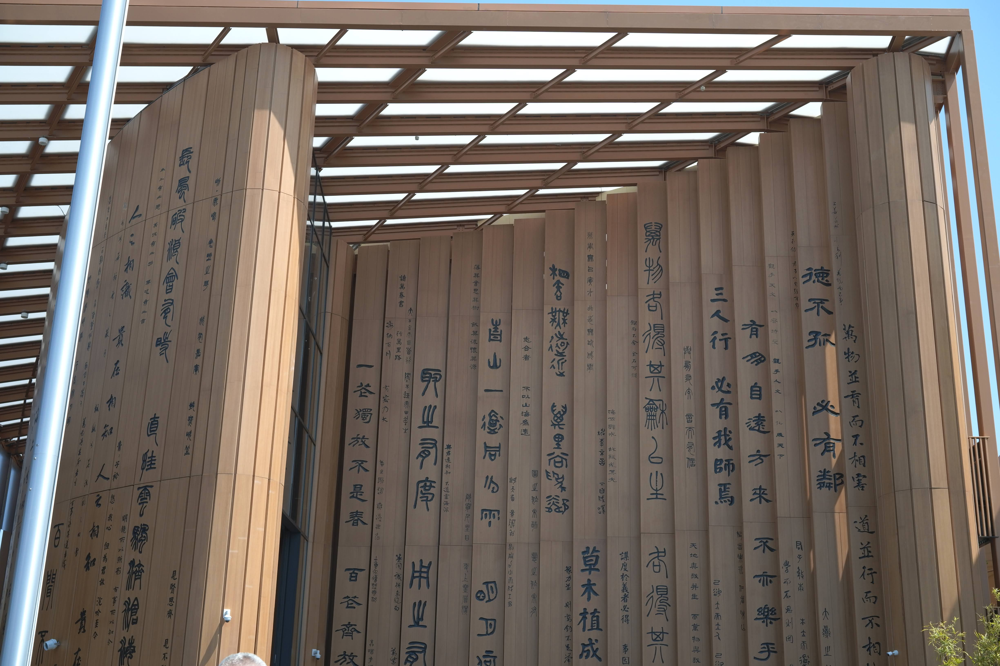
その天井ギリギリに収まるでかい円形ディスプレイも展示されており迫力があった。
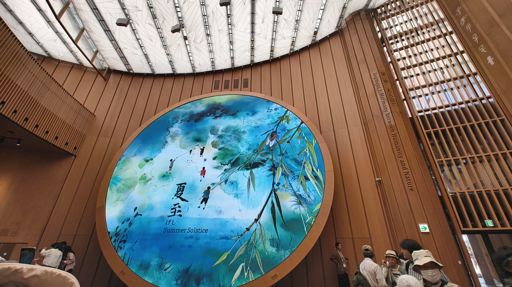
透過ディスプレイが使われており、展示物をみながら解説をすぐ近く見ることができた。
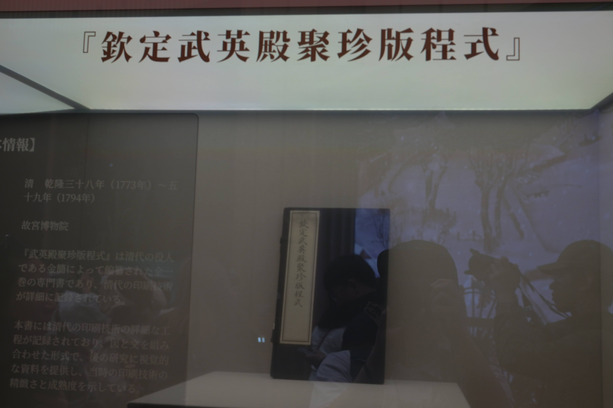

個人的に中国館で印象に残ったのが、ゲームアプリのようなUIで、展示物が紹介されていることだった。パーティ編成画面みたいな画面に、ニワトリとかパンダとかが並んでいた。一周回ってゲーム開発能力を見せる展示なのではと思った。
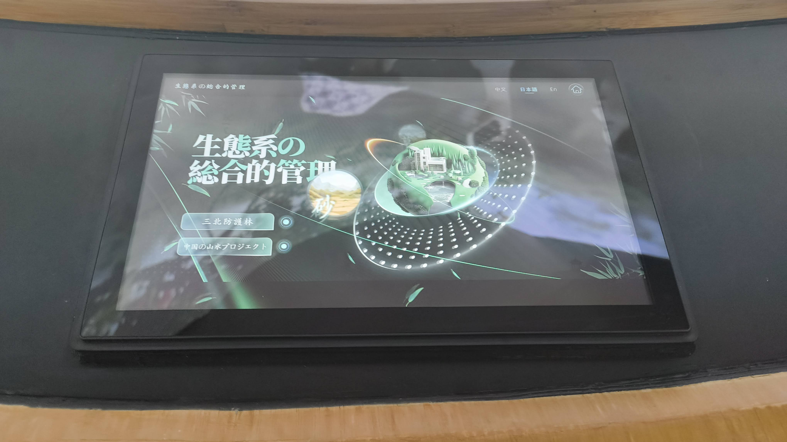

### ブラジル館
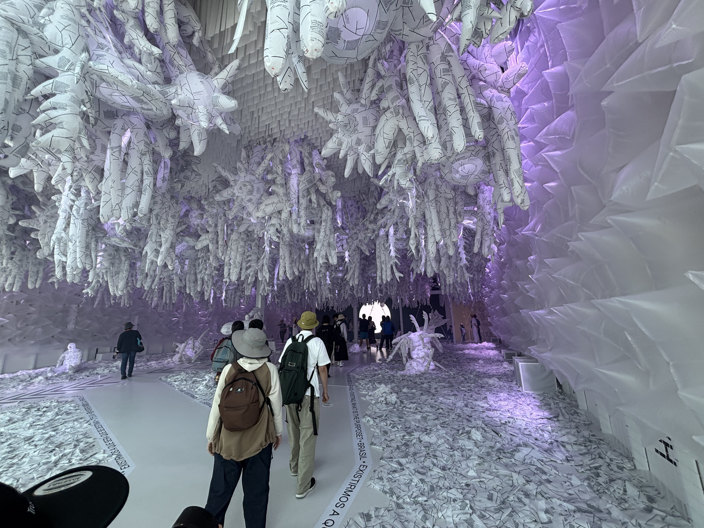
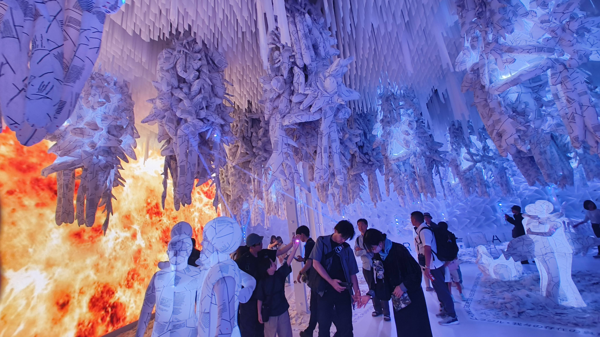
先住民風のフェイスペイントが体験できるブースがあった。手にこみゃくを描いた。
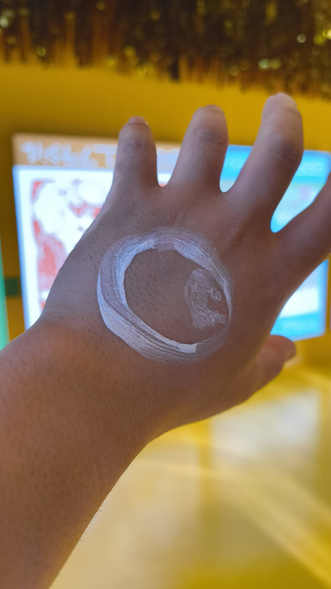
### 北欧館
北欧の暮らしや社会に関する展示がされていた。
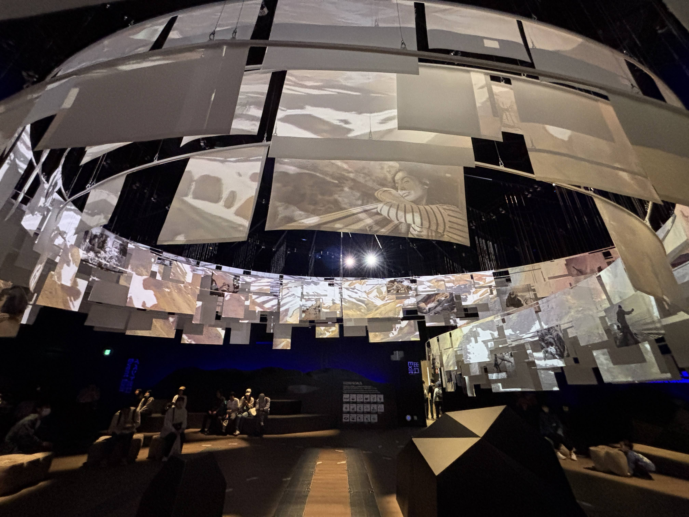
### EARTH MART
たべものに関することが学べる展示がされていた。
いちばん食べられる魚としてイワシがショーケースに陳列されていて、説明を見ると10万匹いた卵から、食卓に並ぶのはそのうち3匹という説明があった。
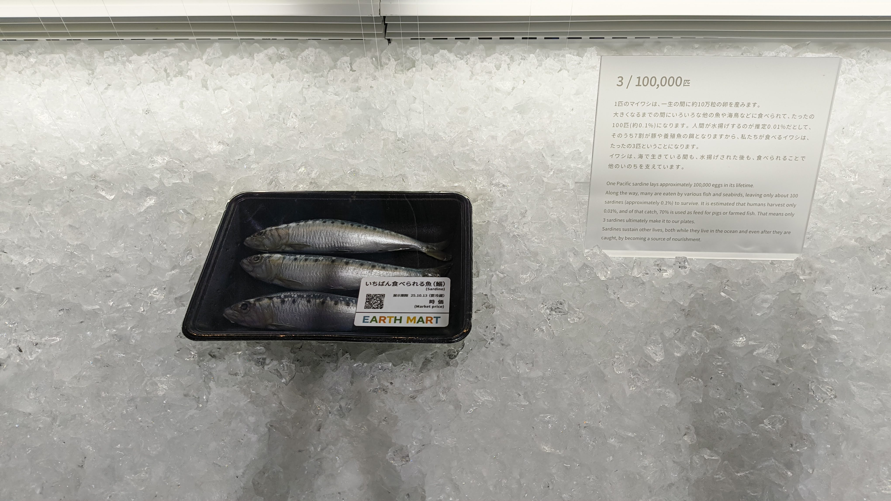
一生で食べる量の卵で作った目玉焼きの模型の展示などもあった。
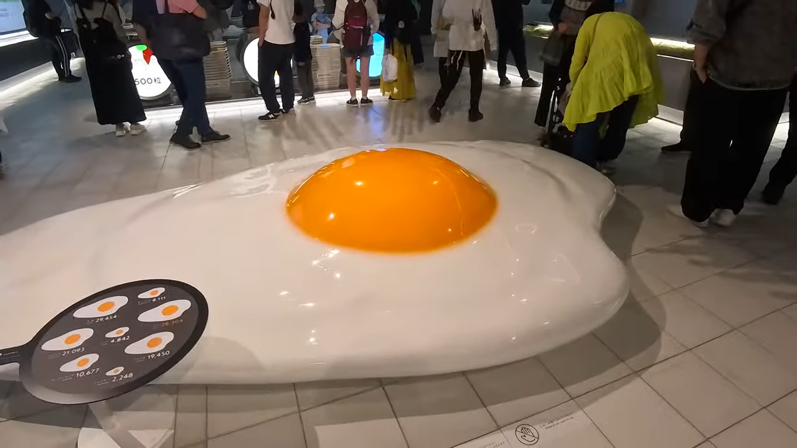

そして、研究が進んでいる新しい食に関する技術も展示されていた。

万博会期中につけた梅干しを十数年後に食べれるチケットをもらった。

### UAE館
アラブ首長国連邦のパビリオン。ナツメヤシの柱が特徴的だった。

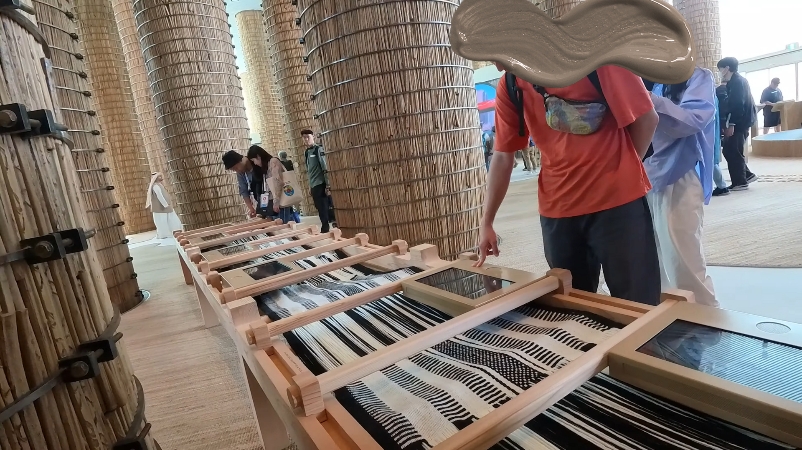
併設されているレストランのご飯をテイクアウトして、大屋根リングの上で食べた。
バーツのコーヒーとタピオカ何かを食べた。
日本では食べることない風味で新鮮な体験ができた。
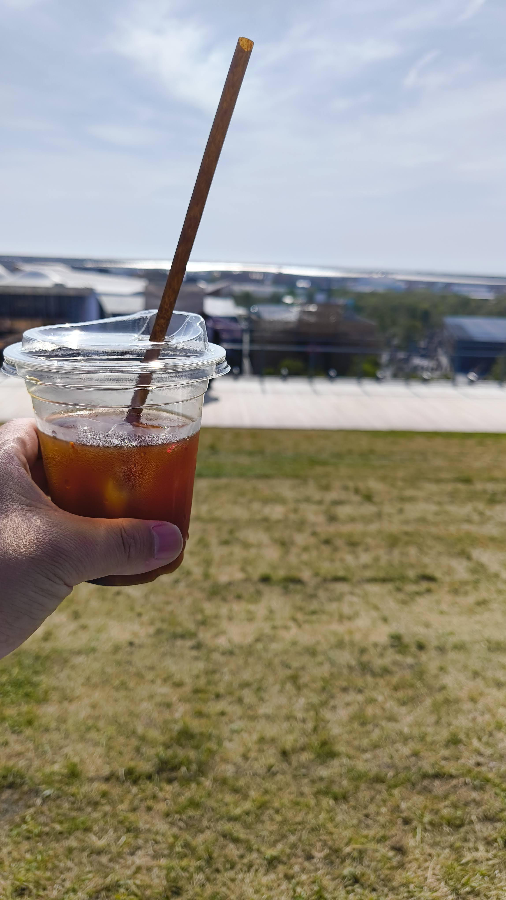
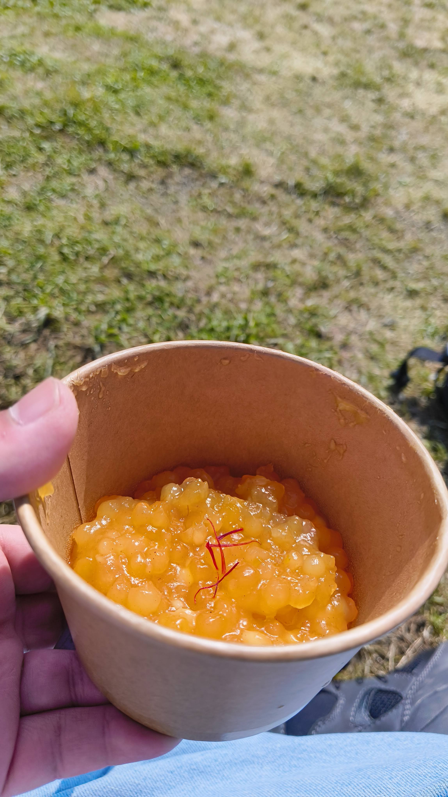
### いのちめぐる冒険

撮影禁止なので写真はない。
円形のソファにみんなで座り、ヘッドセットを身につけ体験するパビリオンだった。

みんなが円形に座っているという前提のもと体験が作られていて、バーチャルだけどオフラインでみんなで集まらないと体験できないようなコンテンツで脱帽した。

### コモンズ館
パキスタンの岩塩が一番印象に残っている。
お土産が売っているので眺めるだけでも楽しかった。

### テックワールド
Tech Worldでは、生命、自然、未来をテーマに、テクノロジーを使った展示をみた。
特に、最初に見た生命に関する展示は、ディスプレイを物理的に動かし、よりダイナミックな展示になっていた。

その後は、4Kレーザープロジェクターで壁一面に投影された台湾の自然に関する映像を見た。このときは綺麗さを感じなかった。
だが、別のパビリオンでプロジェクターを使った展示を見た時に、Tech Worldの映像のきれいさが段違いだったことがわかり、4Kプロジェクターすげぇーとなった。

パビリオンの最後にはフードも頼めたので、台湾パインかき氷を食べた。

### トルクメニスタン館
トルクメニスタンの紹介の映像を見た後に、特産品や文化に関する展示を見た。

### 未来の都市
最初は歩きながら映像を見る感じの展示だったが、後半は日本企業にブースが複数あり、未来の車や、未来の農業など
を知れた。
クボタの農業用の乗り物がかっこよかった。

### マレーシア館
部屋にマレーシアの屋台が再現されていて、見たことない料理の食品サンプルが並んでいて、マレーシアの食文化と街の雰囲気を感じ取れた。

### フランス館
DiorやCHAUMET、Louis Vuittonなどの展示があった。特にDiorの展示では、
白い部屋に白いDiorのトワルが壁一面に飾られていて、圧巻でした。
### 動的平衡館
生き物をテーマとしたインスタレーションを見た。
　
### オーストラリア館
森の中を歩きながら、オーストラリアの動物の映像を見て、最後は部屋の天井、壁に映像が投影された海に飛び込んだような体験ができた。
没入感があり、大迫力だった。
### USA館
スパークが可愛い。
アメリカ人の方が司会進行をするので他のパビリオンよりも、リアルタイムのやりとりがあり、雰囲気がいい。
歌に合わせながらアメリカの文化や産業について知ることができた。
### ポーランド館
ポーランドの伝統工芸から始まり、テクノロジー、ゲームなどポーランドから生まれたものが展示されていた。
ゲームに関しては、知っているゲームタイトルもいくつかあり、これってポーランドの会社だったんだ！という発見があった。
一緒に行ったメンバーは全員エンジニアだったので、逆ポーランド記法で盛り上がった。
### アオと夜の虹のパレ―ド(噴水ショー)
3年かけて作り上げたという噴水ショー。
夜まで残れるなら一度は見たほうがいい。
レーザー、プロジェクター、水、音楽を組み合わせたショーは最高だった。
音楽もいいし、幻想的だった。

### One World, One Planet.(ドローンショー)
会場全体で行われるショー。ドローンショーを初めて見たが、夜空に隊列をなして、正確に動くドローンにびっくりした。

