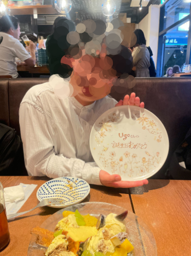
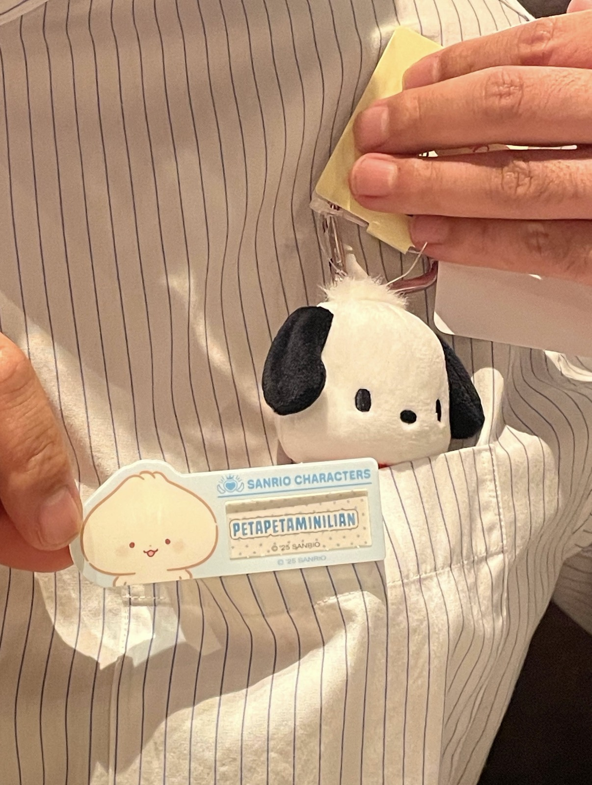

イベントでしかブログが更新されなくなってきたので、近況を書いていく。

## 誕生日
まず、誕生日を迎えた。当日はカルディでケーキを買ってオフィスで、同僚とケーキを食べた。どちらかというと食べさせたと言うのが正しいかもしれない。

去年の年末に、誕生日会しようねという約束をしていたので、同僚二人に宮下パークのイタリアンのお店で誕生日会を開いてもらった。
<emotion type="surprise">
サプライズでケーキが出てきてびっくりした。
</emotion>

二次会では夜パフェに行った。どれも可愛い上に、美味しかった。

## マンション内見
同僚とマンションの話になり、一緒に内見に行くことになった。
２件見た後に、追加の資料を見ていくつか回った。また別の沿線にも移動して、新築のマンションを見た。

どれも自分の条件には当てはまらず見送った。
今の住居を探しているときは、東京の土地勘もなかったことと、引っ越しまでの期限もなかったため不動産屋に丸投げして急いで決めた経緯がある。そのため当時はあまり物件を探すことを楽しめなかったが、現在はある程度土地勘もあり、期限もないため探すのが楽しく感じる。
いい物件があったら買うというくらいのスタンスでいきたい。

## 健康
最近は同僚と帰る時に、渋谷から線路沿いを歩くということをしている。
退勤後に話ながら歩いて帰るのは学生の頃に戻ったようで楽しい。
それ以外の時には、ジムに行っている。

ジムに行く時は、ChatGPTにメニューを組んでもらい、基本それに従うが、マシンの利用状況に応じて適宜メニューを変えている。
やった記録をChatGPTに入力して、今日のサマリーをしてもらっている。

<emotion type="happiness">
肥満体型から、標準体型になったので嬉しい。
</emotion>

以上。近況報告でした。
