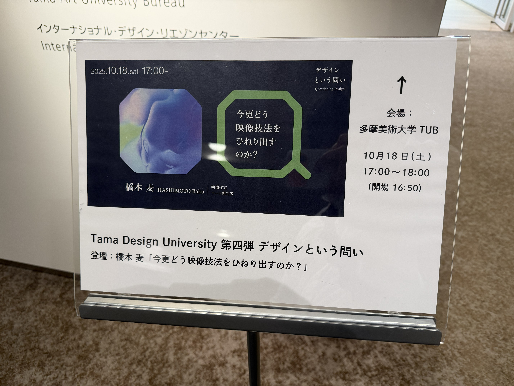

土曜は多摩美術大学の「[デザインという問い](https://tub.tamabi.ac.jp/tdu/4th/)」に行ってきた。

## 今更どう映像技法をひねり出すのか？

橋本 麦さんが、実験映像を作るにあたり、どのように新しい手法を編み出しているのかという話を聞いた。

橋本 麦さんのことを知らない人向けに自分が一番好きなEYEのMVを貼っておく。
<iframe width="560" height="315" src="https://www.youtube.com/embed/WSFeje8-4Vc?si=RZjKXT6JhJ32iy27" title="YouTube video player" frameborder="0" allow="accelerometer; autoplay; clipboard-write; encrypted-media; gyroscope; picture-in-picture; web-share" referrerpolicy="strict-origin-when-cross-origin" allowfullscreen></iframe>

制作過程は[Making-of: group_inou - EYE](https://baku89.com/ja/making-of/eye)で公開されている。制作過程にあるように、映像を作るために道具をツール・ソフトウェアを作り、それらも公開している。

プロセスを映像手法として用いる話では、CNCや3Dプリンターの切削、積層を用いるための実験と、それを用いた映像を見た。
イラストを描くのではなく、既存のアセットを用いて、イラストを描かずに映像を作る方法もいくつか試しいて、[Unicodeを利用した映像手法](https://baku89.com/ja/kamukamo)についても聞いた。
タイトルになっている「ナンセンスの荒野」という言葉は講演で出てきた言葉で一番印象に残っているのでタイトルにした。

## ジム
今週は5日もジムに行った。基本的にウェイトマシンで30分くらいトレーニング、30分～45分のトレッドミルを使ったランニングをしている。

## サブスク管理
Orbitというアプリを入れて、自分が契約しているサービスや、NISAなどの積立投資について一覧化してみた。

契約しているサービスだけで、年間78万円。積立投資に関しては76万円。
年間結構な金額を払っているなということに気が付いた。

Orbitは金額をドルや円で入力できるのが良かった。

## 簿記
簿記3級の勉強をしている。
SUZURIの開発に携わった時に会計の知識が必要となった場面があった。今思えば、簿記の考え方と同じようなところもあり
当時簿記に触れていたら、おそらくもっとドメインを理解しながら実装できたんだろうなと思った。

気持ち良いくらいにロジックがしっかりしていておもろい。楽しい。

## メインバンクを住信SBIからSBI新生へ
SBI新生とSBI証券を連携させるだけで、住信SBIのランク3相当の優遇があって便利だった。
コンビニATMの利用に関しては回数制限なく0円なので、住信SBIよりも魅力的だった。

引き落としの類は三井住友にまとめているので特に問題なく変更できた。

以上。近況報告でした。
