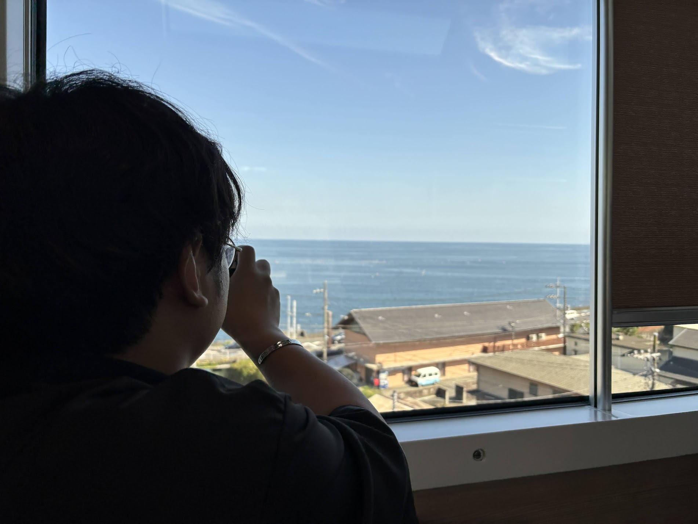
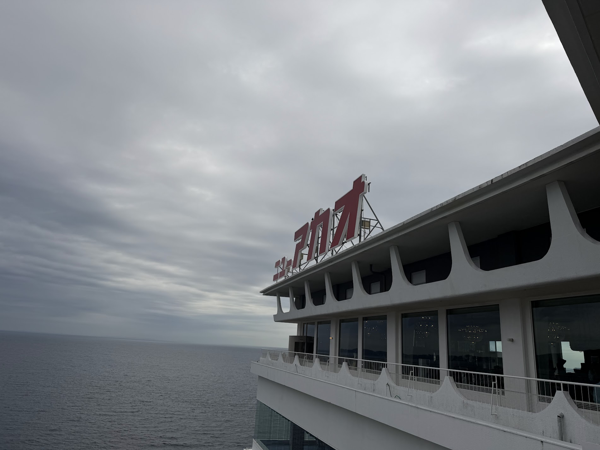
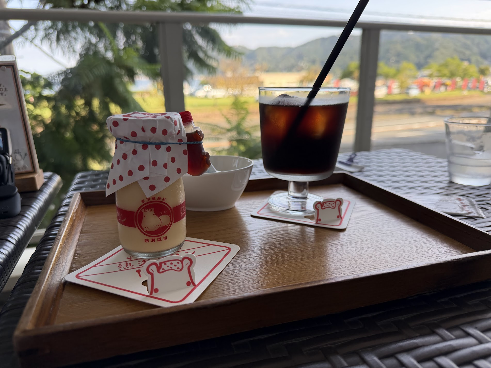
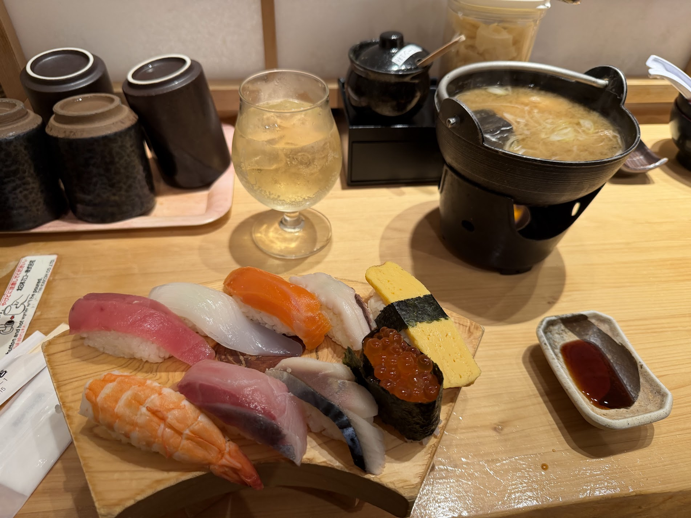

9/26-27で友人と熱海に行ってきた!
今更だがブログに行った感想や思い出を書いていく

## スケジュール

### 1日目
1. 品川駅出発
2. サフィール踊り子カフェテラスで食事
3. 熱海駅着
4. MOA美術館
5. 熱海駅の商店街を散策
6. ホテルニューアカオ着

### 2日目
1. チェックアウト
2. ホテルニューアカオの庭園を散策
3. 熱海駅着
4. レンタカーを借りて、海沿いをドライブ
5. 魚を釣って、海鮮バーベキュー
6. 熱海プリンでおやつ
7. ビーチを散策
8. 熱海城
9. 磯丸で晩御飯
10. 熱海駅出発

## サフィール踊り子
どうしてもサフィール踊り子に乗ってみたかった。
カフェテラスも予約してカレーも食べた。

## MOA美術館
美術館からの景色がとてもよかった。

浄瑠璃物語絵巻が展示されていた。細かなところまで描きこまれていた。今のような技術もない中、途方もない労力かけて描かれたことに圧倒された。

常設展示の万華鏡が投影されている天井の前で記念撮影をした。

## ホテルニューアカオ
どうしても行きたかったホテルニューアカオに宿泊した。
オーシャンウィングの客室だったので、波の音が部屋から聞こえた

昭和レトロな館内はとても広かった。
ダイニングもとても広く、窓からは海が見えて開放的だった。

温泉も３つあったが、海が見えて開放的だった。

## 2日目の観光
レンタカーを借りて、いろんな場所に行った。慣れない地で運転するのは怖かった。

最初は海沿いにある太公望というところに行った。
海で魚を釣った。あじと鯛を一匹づつ釣って、それをさばいて、焼いてたべた

そのあとは、熱海プリンでデザートを食べた。
価格もお手頃でボリュームもありおいしかった。
天気も良かったのでテラス席で食べた。

最後は磯丸というお店であら汁とお寿司を食べた。

いろんなスポットを巡れて、レンタカーという選択肢も今後はありだなと思った。怖いけど。

## 次行くなら、来宮神社にいきたい
来宮神社いいよと友人から聞いていたが、いけなかったので次行くなら来宮神社に行ってみたい。

波の音を感じながら宿でまったりしたり、魚を食べたり、海沿いをドライブしたりと自然を感じた2日間だった。