KomeKaigi2025が11月1日に開催されるため、10月31日の夜〜11月2日まで新潟に行ってきた。

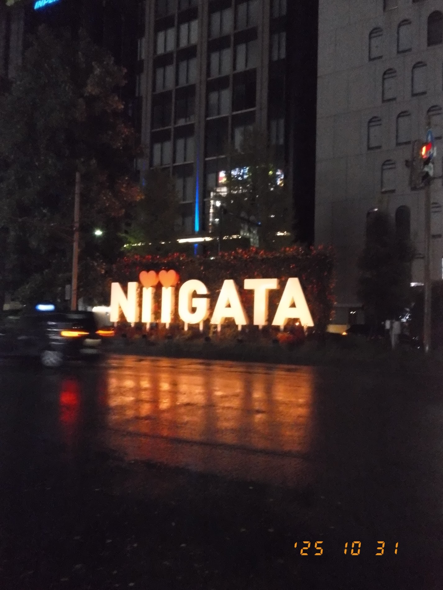

## 1日目
### 夜ご飯
仕事終わりに、新幹線で新潟駅に向かった。渋谷はハロウィンで交通が乱れていて、東京駅に行くのに時間がかかった。

新潟駅周辺の居酒屋に入って、タレカツ丼、村上牛の溶岩焼きなどを食べた。
タレカツ丼は、ご飯の下にもタレカツがありびっくりした。
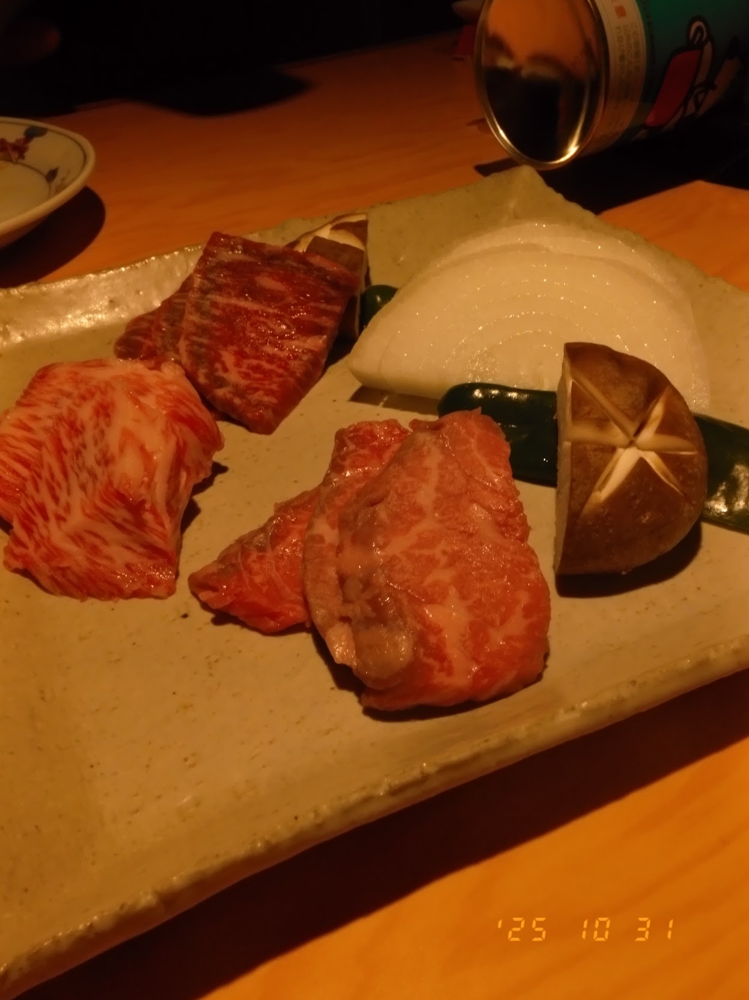

###  ホテルグローバルビュー新潟
[ホテルグローバルビュー新潟](https://www.rio-hotels.co.jp/niigata/)に宿泊した。

大浴場は綺麗で、15時から翌日10時の間は入浴できた。

朝食のモーニングは、
「栃尾の油揚げ」「タレカツ」などもあり、朝から満足感があった。

サラダのドレッシングも1日目と2日目で変わって、こだわりを感じた。

聞いた話によると地元の人もたまにモーニングビュッフェだけ食べにくらしく、人気らしい。

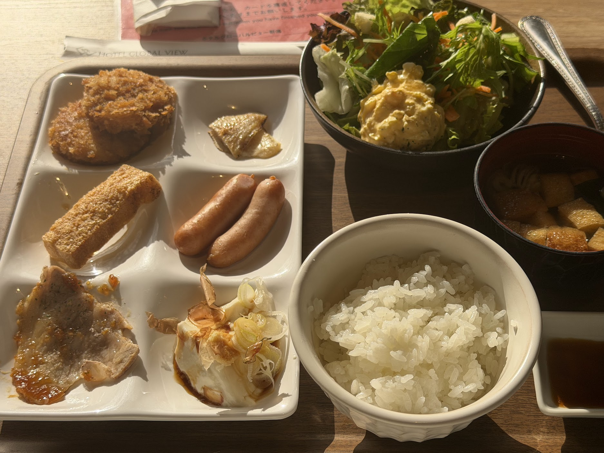
## 2日目：KomeKaigi2025
今回、初開催のKomeKaigi2025に行った。
「新米」をテーマにした初回では、
技術に限らず、キャリア、マネジメントなど多種多様なトピックが発表された。トラックは1トラックなので全てのセッションを聞いた。KomeKaigiに参加した感想の詳細は別に書こうと思う。
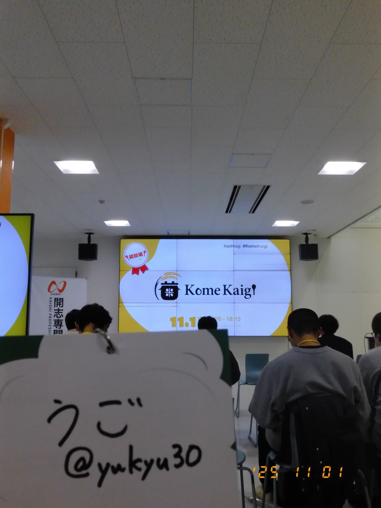

懇親会では、「いかの墨」というお店に行った。
鰤しゃぶ、村上牛の朴葉(ほうぼ)味噌焼き、のどぐろの塩焼き、炊き込みご飯など、美味しいものをたくさん食べた。
炊き込みご飯はだし汁をかけて、お茶漬けとして食べれた。

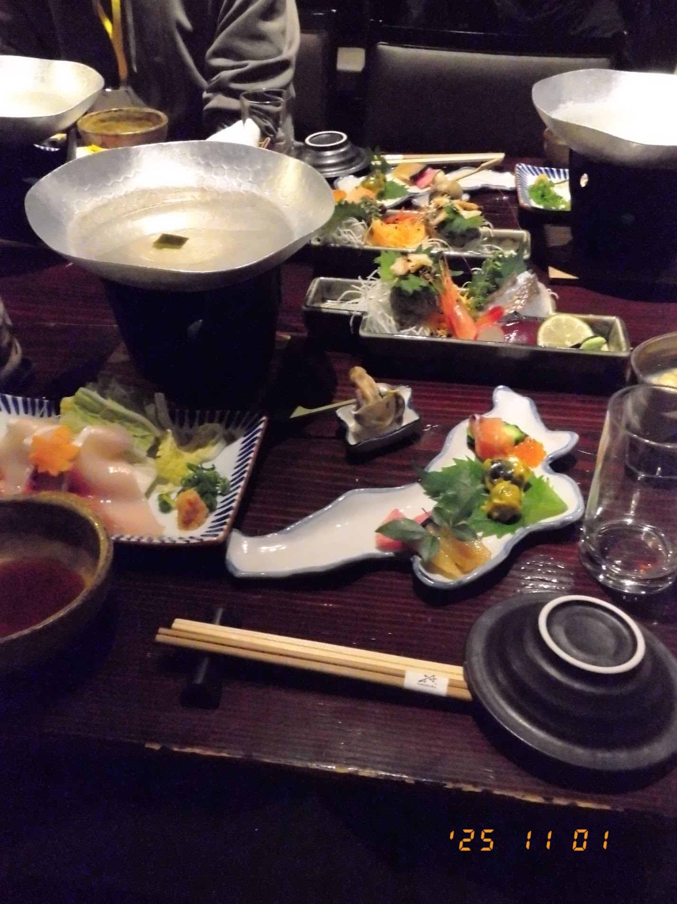
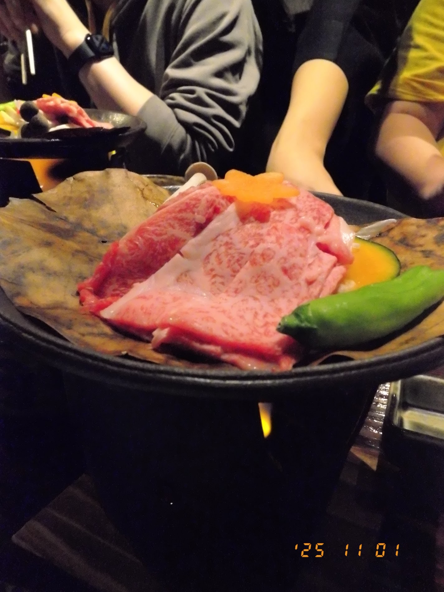
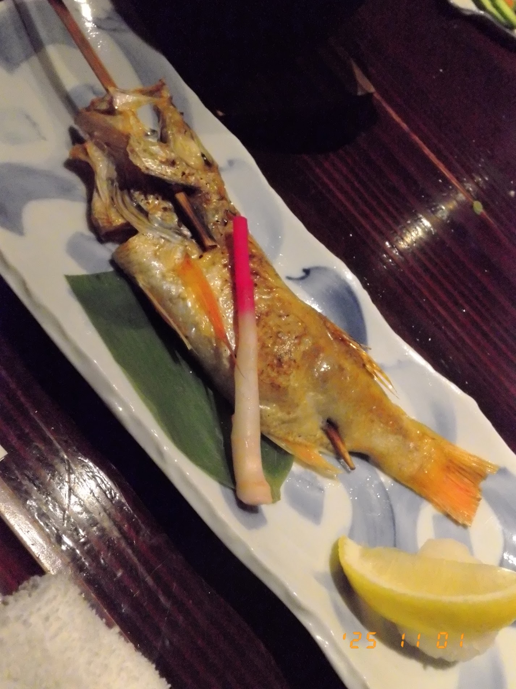
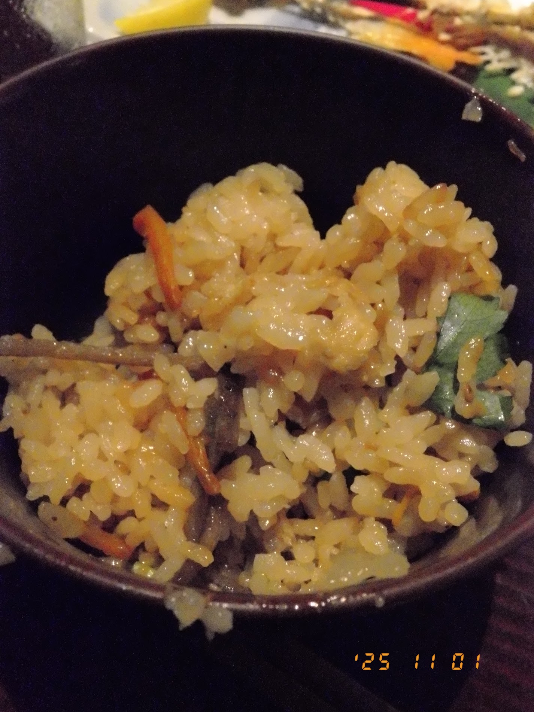

## 3日目：新潟観光

### 弁慶
懇親会で、美味しく安い回転寿司として「弁慶」をおすすめされたので、お昼に行った。
11時から営業だが、11時30分には70分待ちとアナウンスされるくらいには人気だった。

佐渡産のお寿司が二貫で330円から食べられた。
どのネタも美味しかった。
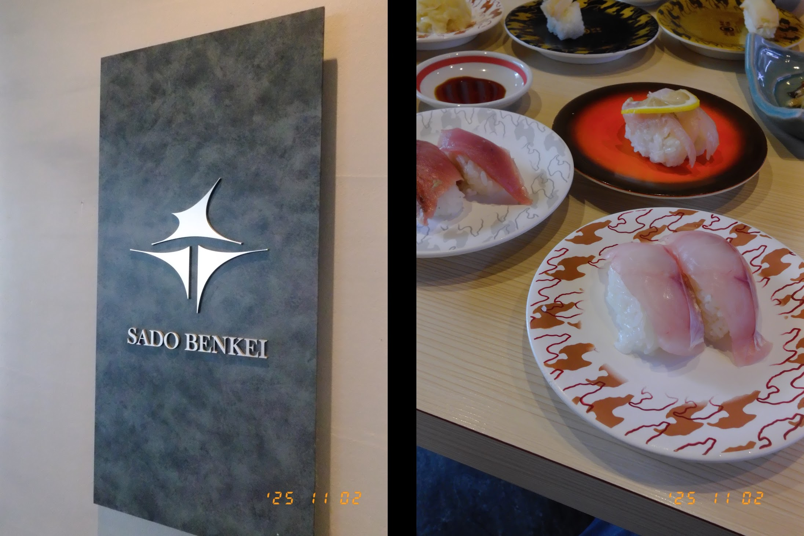

### KomeFest
KomeFestは、5種類のお米が食べ比べできるイベントで、
豚汁とお米がお代わりし放題だった。
どのお米が一番うまいか吟味して食べて、その美味しかったやつをお代わりするということをした。

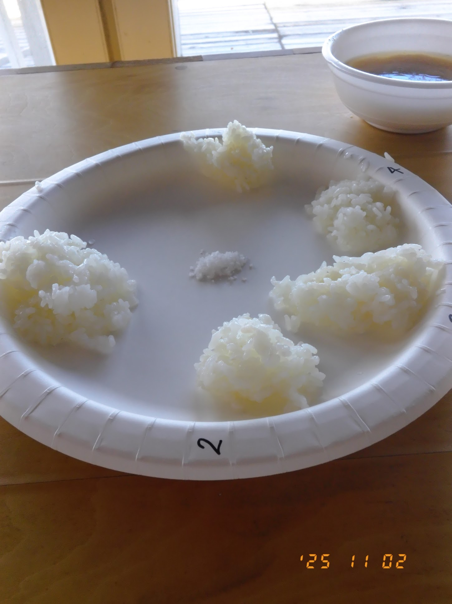
### ぽんしゅ館

新潟駅直結のぽんしゅ館で日本酒を飲んだ。
おちょこ3杯分飲んだ。
そこで飲んだウィスキー樽で貯蔵した日本酒が美味しかったのでお土産に買った。

[ウイスキー樽で貯蔵した日本酒 720ml（化粧箱入）](https://shop.ponshukan.com/view/item/000000000117)

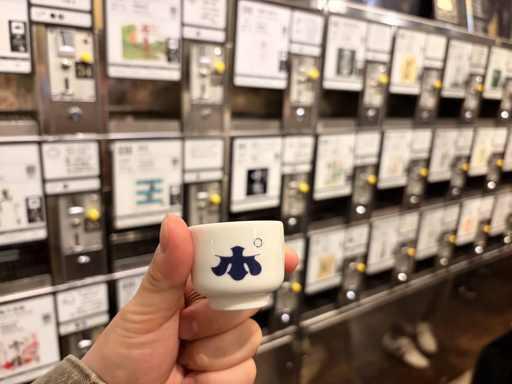
