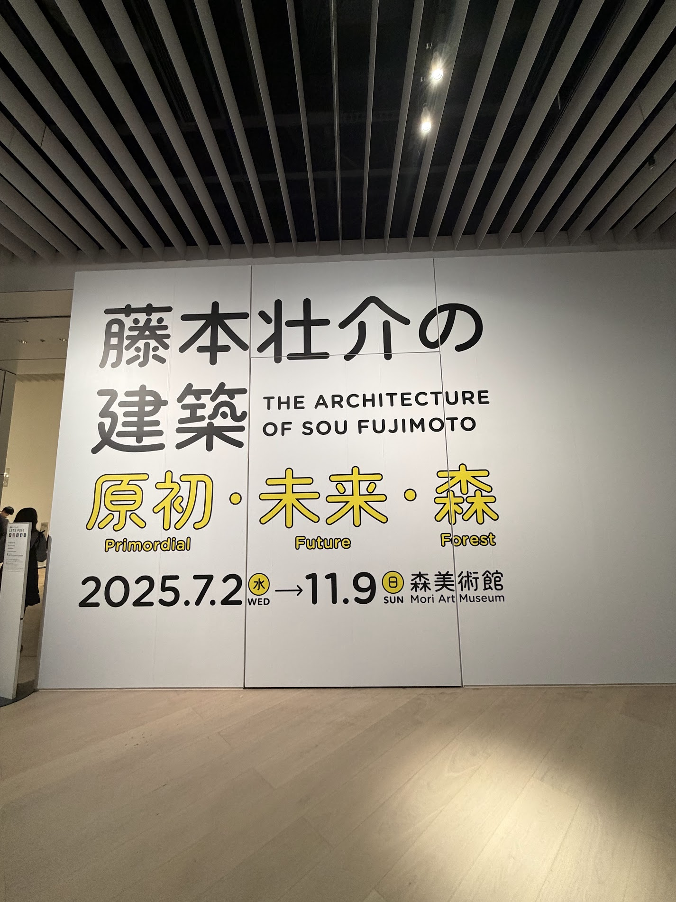
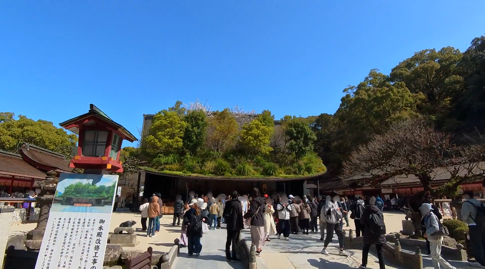
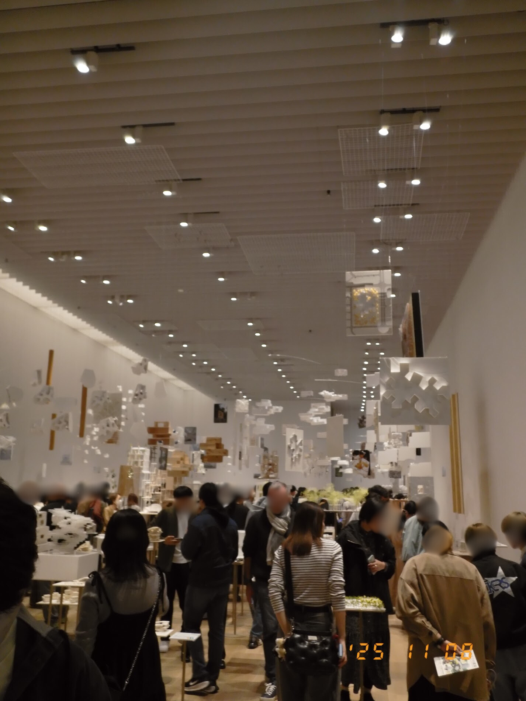
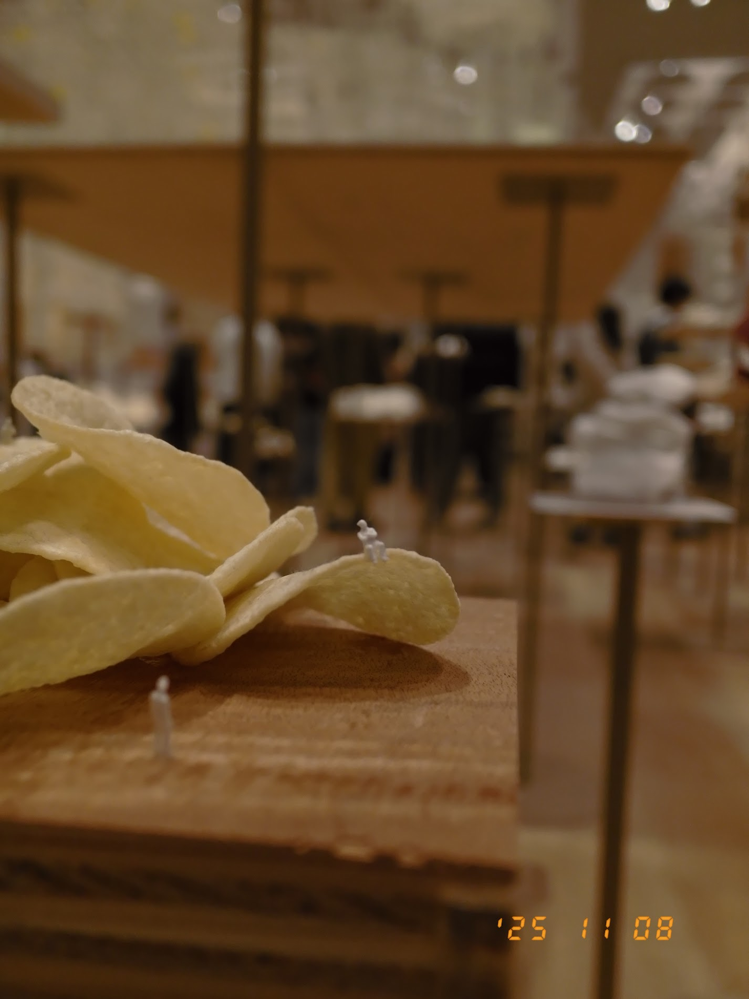
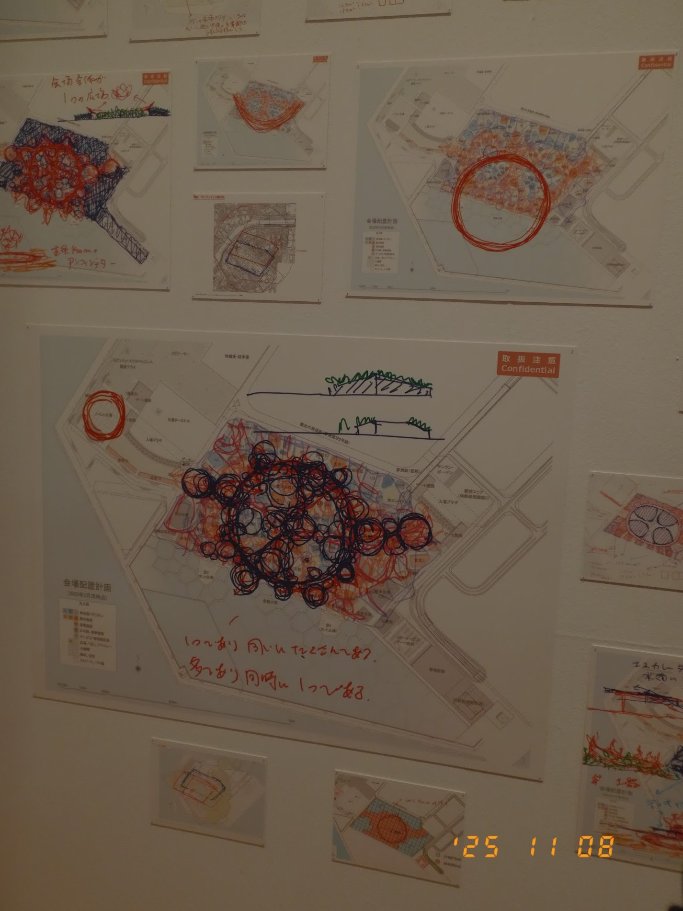
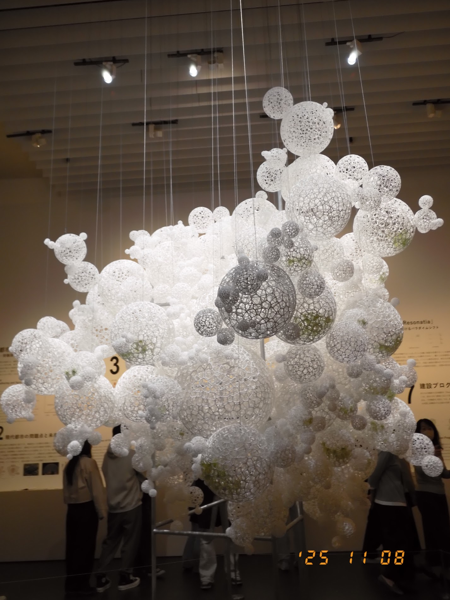

森美術館の『藤本壮介の建築：原初・未来・森』に行ってきた。

福岡に行った際、太宰府天満宮に行き、藤本さんのデザインした仮殿をみた。

太宰府天満宮の敷地内では、藤本さんが仮殿を設計するまでのさまざまな案が展示されていた。
その案の数は多く、さらにそれらの模型や、試行錯誤を感じられる手書きの文字の入ったイメージなど、地道ながら壮大な仕事を感じられた。その展示を経て、藤本壮介さんの名前が強く印象に残っていた。

その後、[マシン・ラブ展に行った時](https://yukyu.net/posts/2025-05-25)に、「藤本壮介の建築：原初・未来・森」と書かれたフライヤーをみつけて、絶対に行きたいと思っていた。

## 圧倒的物量の展示
これまで関わってきたものの模型やイメージが所狭しと配置されていた。天井からも吊り下げられているその量に圧倒された。

展示されていた作品は
「たくさんのたくさん」「ひらかれ、かこわれ」、「未分化」の三つに系譜に分類され、どの系譜がわかるように印がついていた。

展示された模型を見ながらどの系譜でその要素は何なのか考えながら見るのがとても楽しかった。
また、松ぼっくりや、重ねたポテトチップを人を立たものが展示されていた。翌日、食べたフライドポテトの山が建築に見えた。

建築は外部と内部を何らかで境界作ることになるため、その境界をできるだけ無くすことを心がけているといった内容がインタビューで語られていた。

大屋根リングにはかこわれているが、ひらかれていて行き来できる。まさしくその境界を無くした建築だと感じた。

展示の最後にある共鳴都市2025では、貨幣制度などにより人類を類型して分化している社会を建築によって、つなげる新たな都市建築モデルが提案されていた。

建築に幾何学的な美しさや、壮大さだけでなく、その裏側にある哲学を強く感じることができた展示だった。
