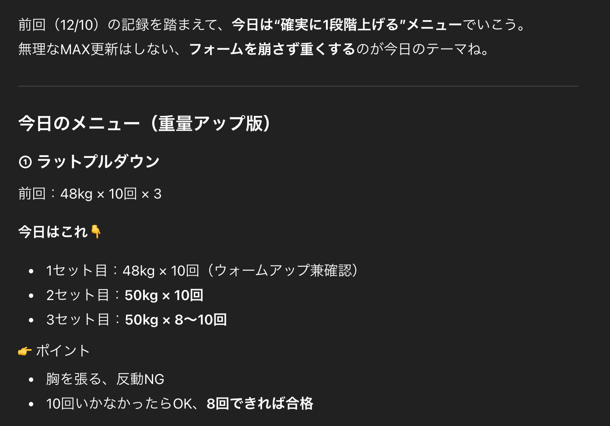
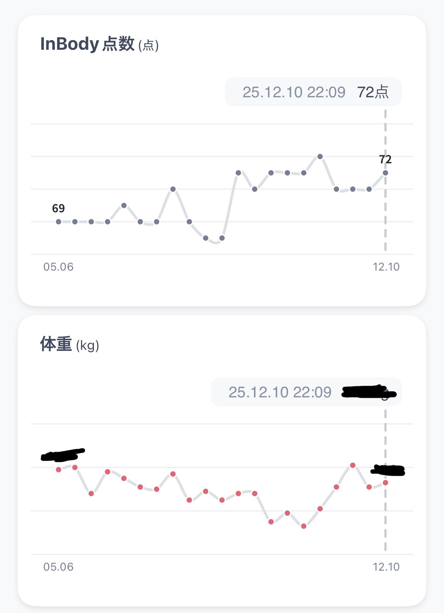
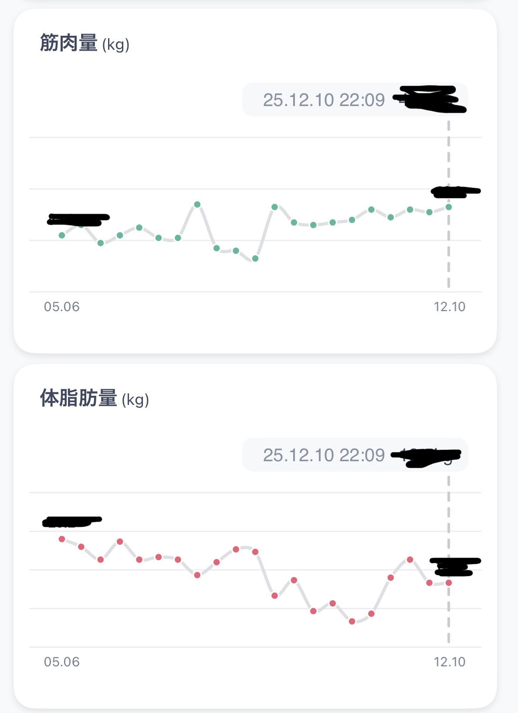

この記事は、[#意識低いトレーニング部 Advent Calendar 2025](https://adventar.org/calendars/11903)の18日目です。

---

今年取り組んだトレーニングについて話します。

## 近所のジムで運動する頻度がアップ
4月ごろに近所のジムに入会しました。
オフィスにジムはありますが、近所にあることでちょっとした時間でも行けるようになり、ジムに行く頻度が増えました。週2-3回程度行っています。

## CMF Watchで心拍数トラッキング
ジムで運動をする中で、日頃から心拍数を計測して、運動時に活かしたいなと思っていました。有酸素であれば、平常時心拍数からどれくらい上がっているかで負荷が適切かなどを確認したいなと思っていました。

そこで、[CMF Watch 3 pro](https://jp.nothing.tech/products/cmf-watch-3-pro?%E3%82%AB%E3%83%A9%E3%83%BC=Light+Green)を購入しました。
安いのと、バッテリー持ち、デザインが決め手でした。
今でも使っています。

## ジム:ChatGPTでトレーニングのコーチをしてもらう
ChatGPTのにトレーニングのコーチになってもらっています。
やっていることとしては、ジムに行った時にメニューのプランニングです。

運動の記録はBurnFitに登録しています。記録をし終えたら、今日のメニューのサマリーをスクショして、ChatGPTに送ると次回のメニューで前回は〇〇kgの持ち上げられたので今日は〇〇kgにしましょうと提案してくれます。

## 変化：概ね健康になってきた

指標は大体改善してきているが、もう少しスピードを上げたいところ。

## 終わりに
来年も続けて、もっと早く体脂肪を減らせるようにしたいです。

腹筋割るぞ
