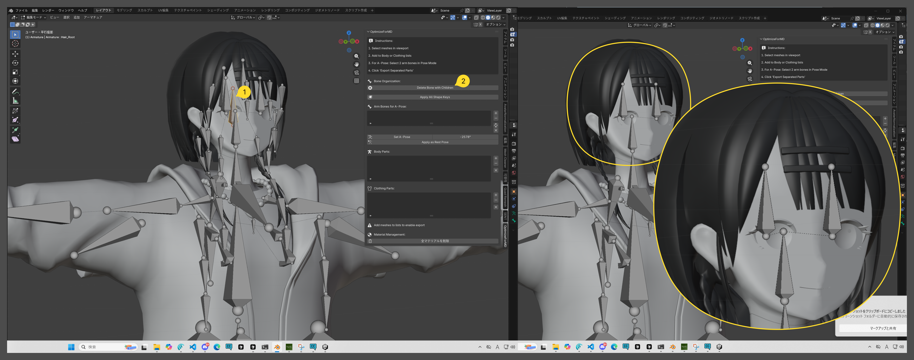
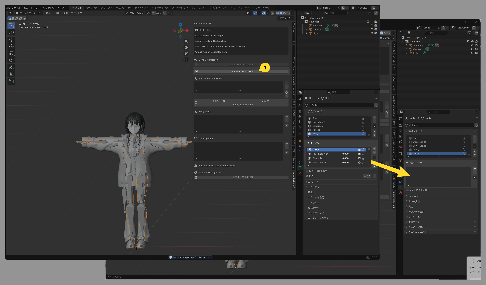
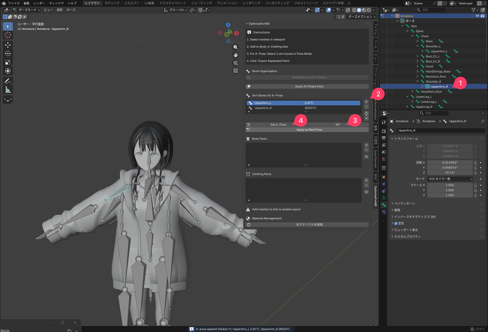
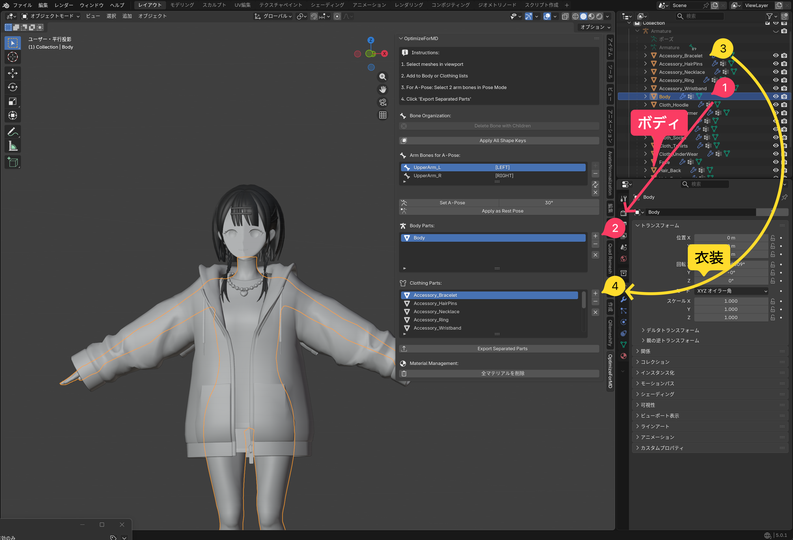
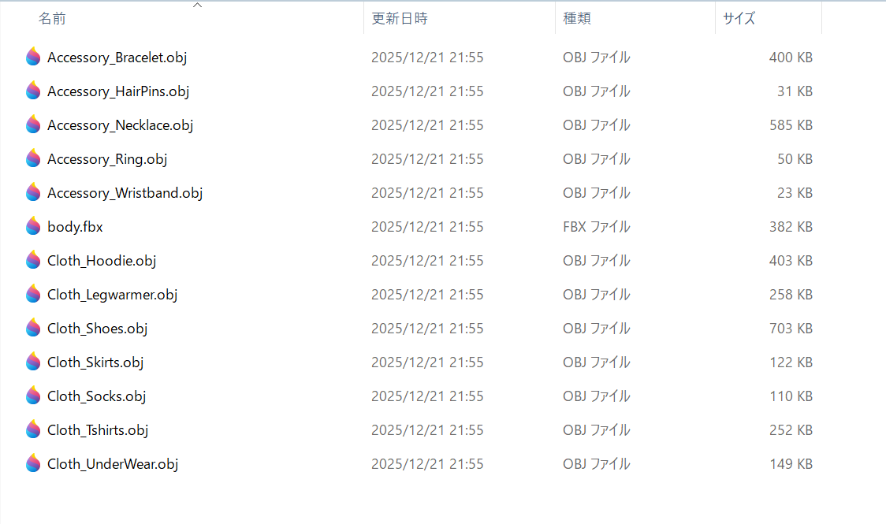
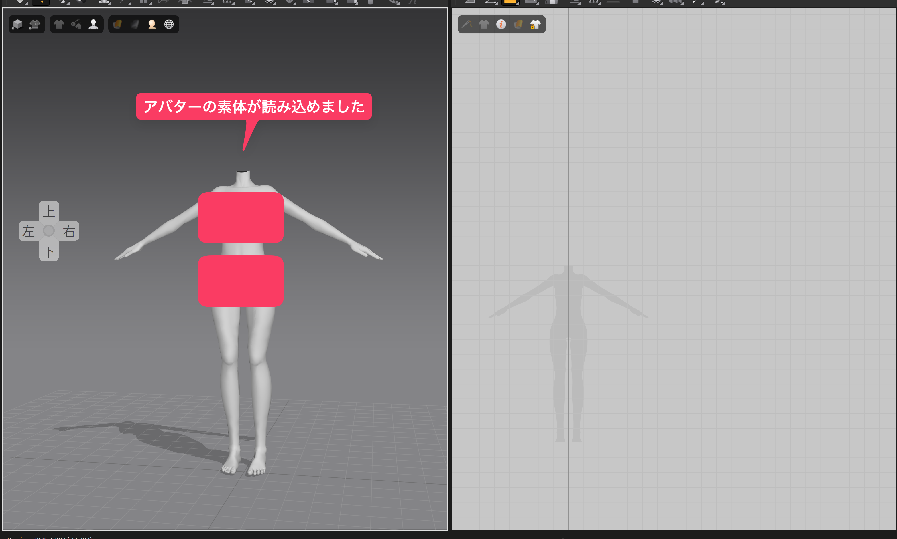
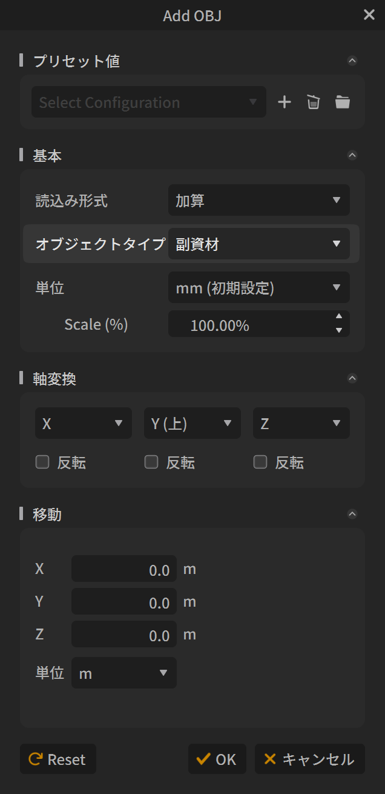
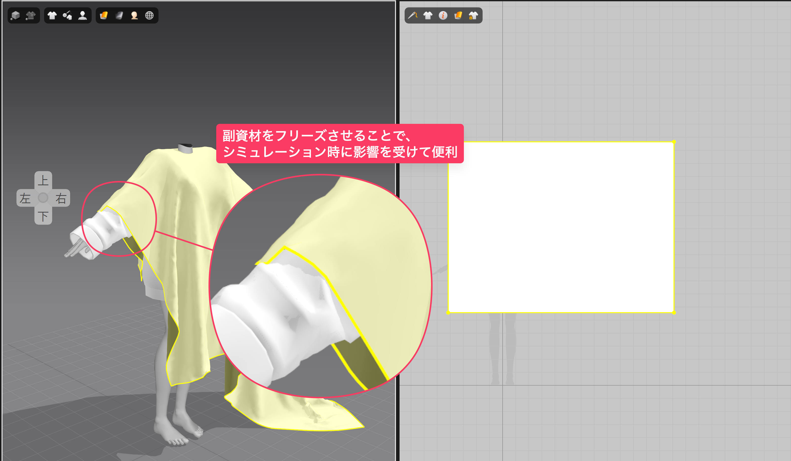
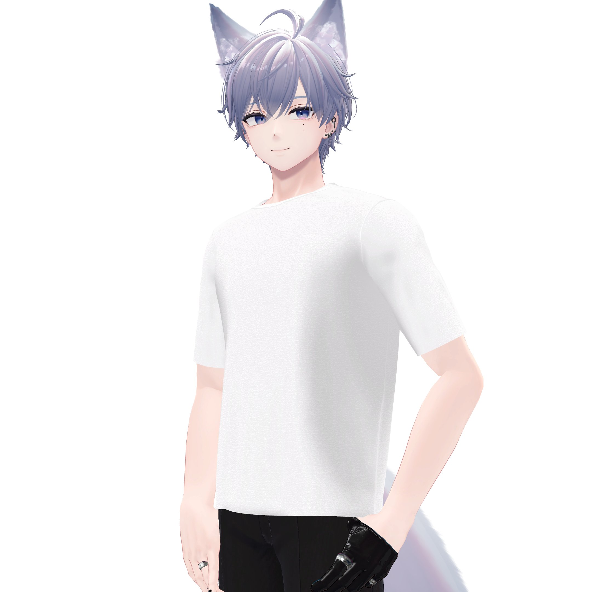

---
この記事は、[GMOペパボ エンジニア アドベントカレンダー](https://adventar.org/calendars/11929)の22日目の記事です

---

VRChat向けのアバターをMarvelous Designerに持っていくのが面倒でした。そこで、それをサポートするBlenderアドオン「OptimizeForMD」を作りました。

## ダウンロ-ド
ダウンロード先は以下の2つです。

**GitHub**
https://github.com/yukyu30/OptimizeForMD/releases

**SUZURI**
<iframe height="164" width="375" src="https://suzuri.jp/yukyu30/digital_products/117001/embed"></iframe>

## 機能
Blender4.0,5.0系での動作を確認しています。
- ボーンの削除 - 選択したボーンの子ボーンを一括削除
- シェイプキーの一括適用 - 現在の状態をデフォルトとして適用し、他を削除
- Aポーズ変換 - VRChatアバターをAポーズに簡単変換
- Bodyと衣装の分割エクスポート - ボディはFBX、衣装はobjで別々に出力
- マテリアルの一括削除 - マテリアルエラー回避のため一括削除

## 使い方
### ボーンの削除
Hair Rootなどを選択して、
Delete Bone with Child Bonesを実行すると、選んだボーンの子のすべてのボーンを一括削除します。

### シェイプキーの一括適用
Apply All Shapekeysを実行すると、現在の状態をデフォルトとしてシェイプキーを適用し、他のシェイプキーを削除します。

### Aポーズ変換
Aポーズの変換、適用を簡単にできる機能です。

1. 腕のボーンのうち肩側のボーンをアクティブにする
2. +ボタンを押しボーンを選択し、両肩分スロットに追加します
3. 腕を下げる角度を調整
4. Set A Poseを実行し、Aポーズの確認をします
5. 確認して問題がなかったら、 Apply as Rest Poseを押してAポーズを適用します

### Bodyと衣装の分割エクスポート
Aポーズ同様に、メッシュを選択、+ボタンを押して、Body・衣装のスロットに分けて登録していきます。
その後、Export Separeted Partsを実行すると、アバターはFBX、衣装はobjとしてエクスポートされます。

### マテリアルの一括削除
マテリアルエラーになっているマテリアルがあると、Marvelous Designerにうまく読み込めなくなるため必要に応じて削除します。

### Marvelous Designerにインポートする
body.fbxは通常通りアバターとしてインポートします。
デフォルトの設定で読み込めば、正しく読み込まれるはずです。

objは副資材としてインポートします。インポートから追加を選び、objファイルを選択します。

副資材を選択して、フリーズさせるとシミュレーション時に物理演算が有効になります。これによって、重ね着の衣装を作る際やアバターの標準の下着をそのまま利用して衣装を作成できます。

## アドオン制作の過程

### MD特有の必要な処理や設定の洗い出し
Marvelous Designerにアバターとして取り込むための必要な処理や設定を洗い出しました。自分が実際に作業をする中で必要になったものと中心に以下の5つを実装しました。

1. Aポーズの設定
2. ボディと衣装での分割
2. シェイプキーの適用
3. 子ボーンの一括削除
5. マテリアルの一括削除

#### Aポーズの変換
Marvelous　DesignerではAポーズアバターを使うのが基本ですが、多くのVRChatアバターはAポーズではないため、Aポーズの変換を簡単に行なうようにしました

#### ボディと衣装での分割
自分が衣装を作る時は、ボディーはアバターとして読み込むためFBXとして出力し、衣装は副資材として読み込むためobjとして出力したいと思っていました。
ボディとしてエクスポートするものはbody.fbxとして複数のメッシュを1つにまとめて出力して、衣装はさまざまな組み合わせで読み込みたいため、衣装のメッシュをそれぞれobjとして出力用にしました。

#### シェイプキーの削除
アバターにシェイプキーがあると、Marvelous Designerで読み込んだ時に、意図しないシェイプキーが適用されてしまうことがありました。なので、現在の状態をデフォルトとしてシェイプキーを適用して他のシェイプキーを削除するようにしました。

#### 子ボーンの一括削除
アバターに髪・ゆれもののボーンなど含めるとMarvelous Designerで配置点のエラーにつながるためボーンをぽちぽち削除していました。それサポートするように選んだボーンの子のすべてのボーンを一括で削除できるようにしました。

#### マテリアルの一括削除
アバターにマテリアルエラーがある状態で、エクスポートし、Marvelous Designerに読み込むと、アバターが正しく読み込めません。マテリアルエラーを直すのも手ですが、素体として使いたいため、マテリアルを一括削除する機能をつけました。

#### エクスポート設定
かずのこさんの記事を参考に、Blenderからエクスポートするときスケール1000倍にすると言ったいくつかのコツを適してエクスポートできるようにしました。

### ClaudeCodeとWatchAddonを使った迅速な開発
ClaudeCodeを使ってアドオンの開発を行いました。
開発中は、アドオンの動作を確認、エラー文をペーストして、修正・改善のループを繰り返す必要があります。

動作確認のたびにインストールし直すのが面倒なので、ファイルが編集されるたびにアドオンを再読み込みする「[WatchAddon](https://github.com/SaitoTsutomu/WatchAddon)」を利用しました。

## おわりに
自分でVRChatアバターをMarvelous Designerに持っていく作業を楽にするために作ったツールですが、同じような悩みを持っている方の助けになれば嬉しいです。

最近はシンプルな服をMarvelous Designerで作って楽しんでいます。

