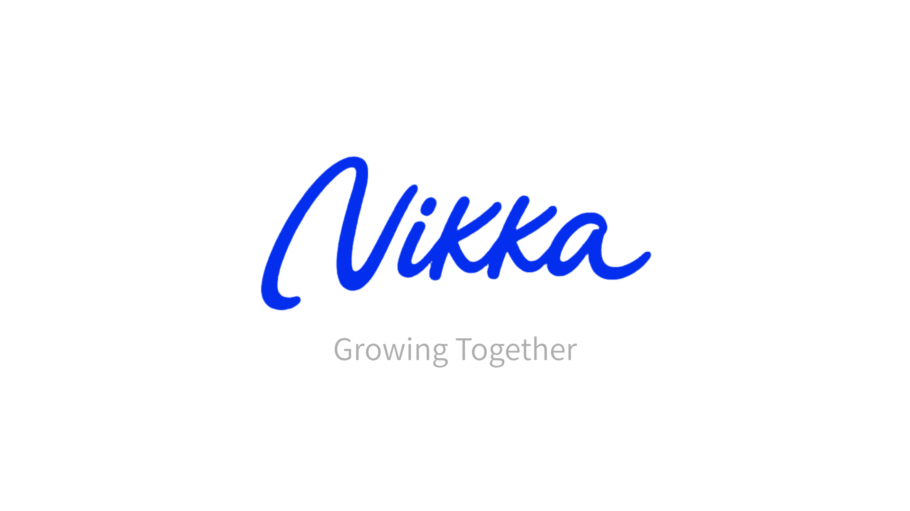
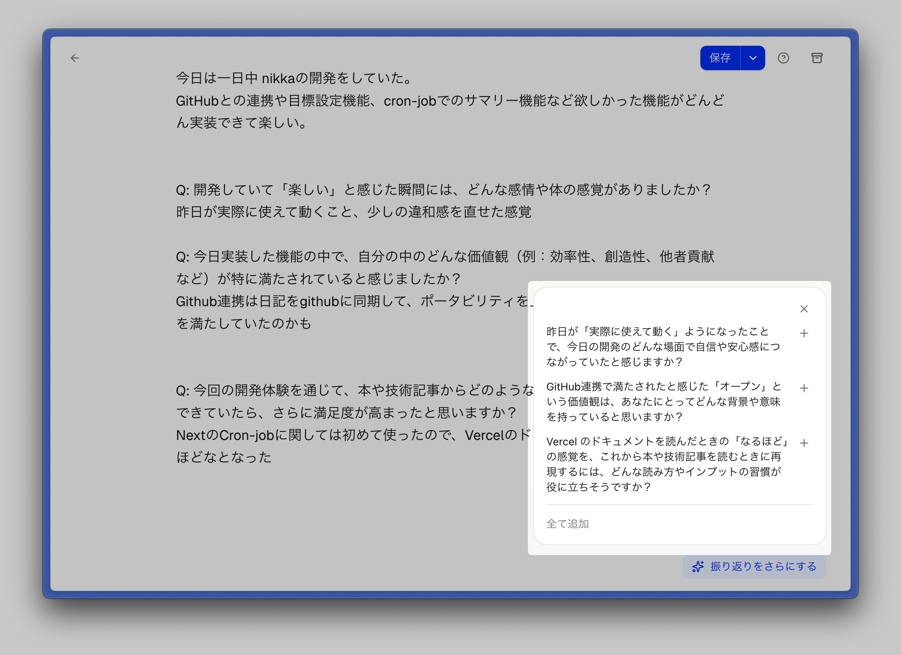
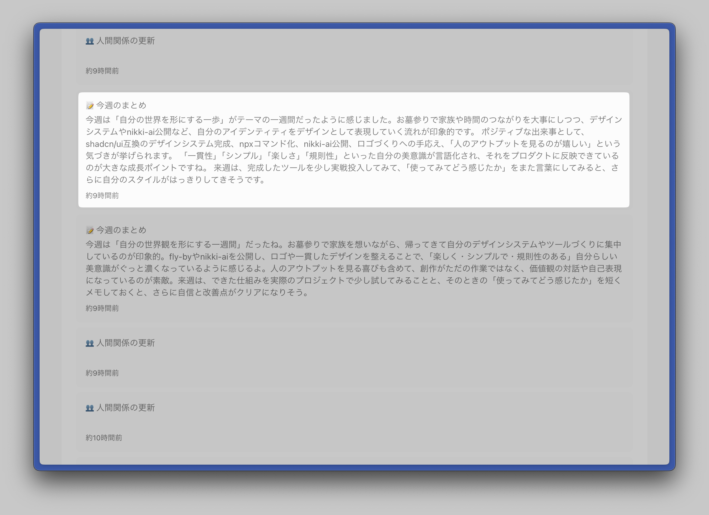
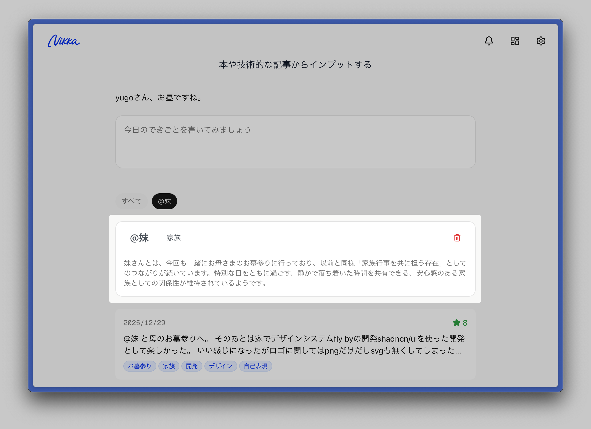
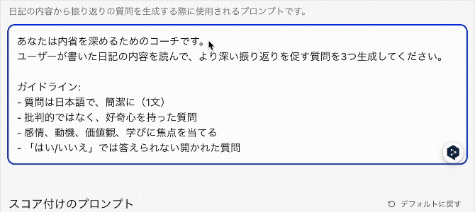

今年こそ日記を続けようと思い、自分が欲しかった機能を詰め込んだ日記「Nikka」を作りました。

## できること
- 日記を書いて、AIからの質問で深掘り
- 1週間のハイライトを毎週金曜夜に配信
- 目標の設定し、質問による目標達成のサポート

### 新たな発見
- @メンションで日記に人を関連づけ
- 関連づけた人との関係性をAIが分析

### AI Ready
- GitHub連携で、日記に内容をマークダウンとして保存・同期
- ClaudeCodeやNotebookLMを活用した振り返りに活用

## 技術的な話

### 技術スタック
- フロントエンド: Next.js
- DB: Neon
- ORM: drizzle-orm
- 認証: Clerk

### Clearkで認証を簡単に
日記という極めてプライベートなものをとりあつかうためセキュリティを重視していることからClerkを採用した。
Auth.jsも考えたが、セキュリティのことを考えながら実装は時間がかかりそうなので見送った。

ClerkはWebUIで設定していき、DNSにCNAMEを追加するだけで独自ドメインでの運用も簡単にできた。

ユーザーの管理、招待もClerkで完結できるので、非常に楽だった。
ソーシャルアカウントとの複数連携もClerkが対応しており、後からGitHub連携機能を作るときもスムーズに実装できた。

### Next.jsのCronJobで定期処理
Next.jsでは、CronJobを設定できるようになった。
1週間のハイライト生成機能、人間関係の分析機能はCronJobで定期的に実行するようにしている。

## 作る上で考えたこと

### 日記を書くことだけに集中できるように
タイトルは設定できない、タグも自由に設定できないことにして、文章を書くこと以外で考えることを減らした。
見出しもレベル1までしかないので、日記の体裁を整えることに時間をかけず、日記を書くことに集中できる。

(ちなみに、Github連携でマークダウンをexportするときは見出しは全て、見出しレベル2として変換されるようにするようにしている)

新規作成ボタンも無くした。トップのテキストエリアに文字を入力したら、そのまま新規日記として保存・執筆ページへ移動するようにした。

### 設定画面での保存ボタンいるのか？いらないのか？
設定画面の保存ボタンへの取り扱いに結構悩んだ。
当初は２通りを考えていた。

1. 設定を変更したら、保存するボタンを押して保存(以下、マニュアルセーブ)
2. 設定を変更したら、自動的に保存される(以下、オートセーブ)

マニュアルセーブに関しては、ユーザーが誤って変更しても、保存しなければいい。しかし、設定項目が長くなると下部にある保存ボタンに気づかない。
オートセーブに関しては、ユーザーが意図しない変更が保存されてしまう可能性があり、それを戻す手段がない。

マニュアルセーブの方針にすることにしたが、保存ボタンに気づかない問題は解決できていない。
そこでClaudeの設定画面を見たところ設定が変更された時だけ、そのすぐ下に保存ボタンが表示されるようになっていた。最終的にこの方針を採用し、実装した。

## おわりに
このNikkaは自分で使うことを前提に作ってはいるが、他の人も使えるように構築はしている。
もし使ってみたい人がいたら、声をかけて欲しい。ただ、開発中にDBを見ることがあるため、完全にプライベートな日記としては使えないことを了承して欲しい。

